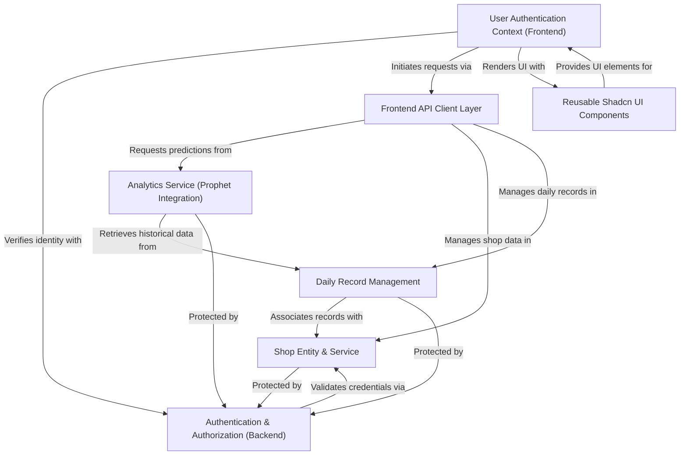
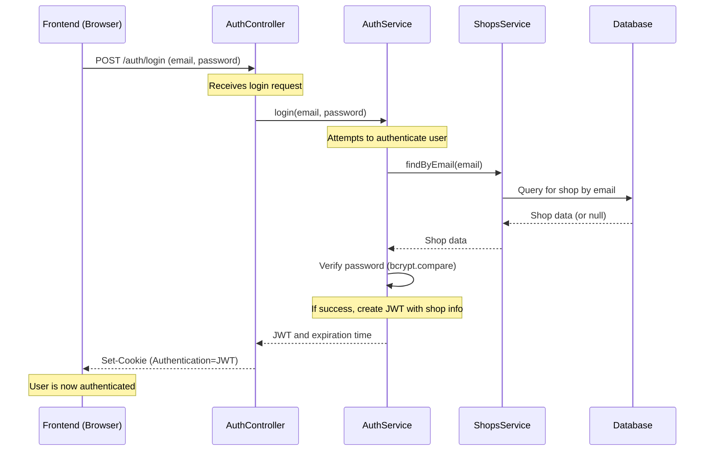
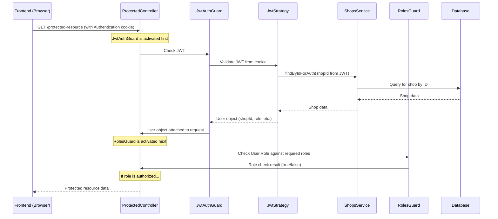
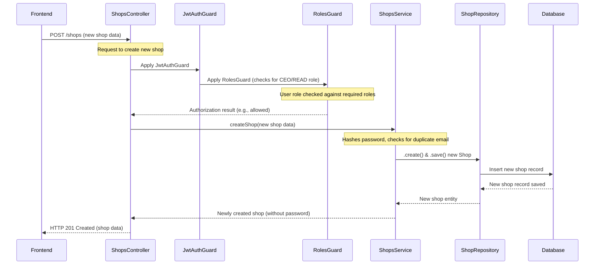
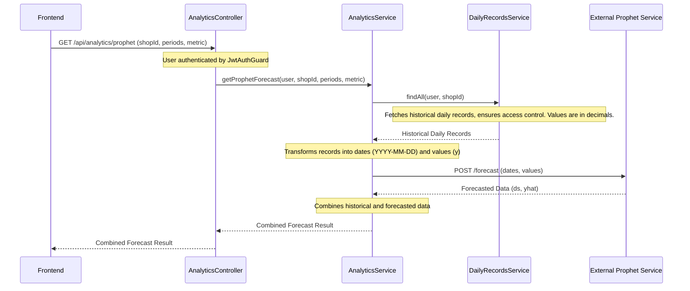
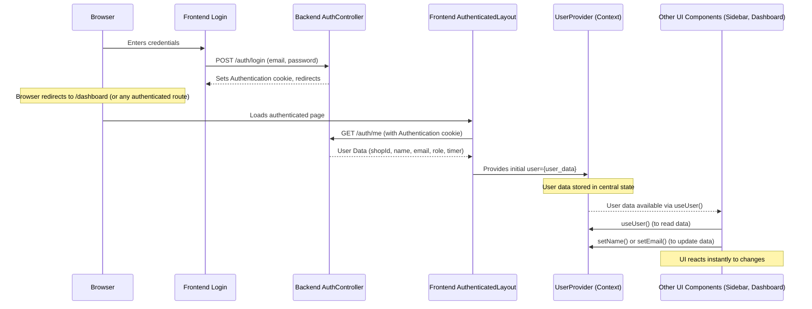
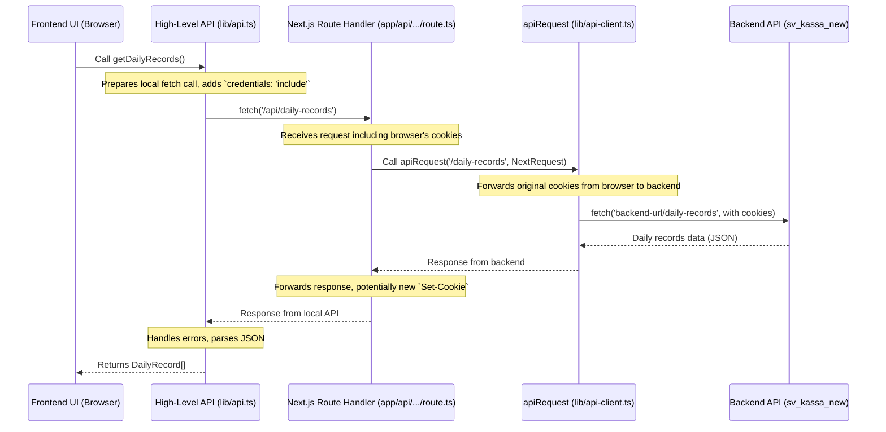

# Tutorial: sv_kassa_new

This project is a **web application** designed for *managing daily financial and inventory records* for various shops. It offers **secure authentication with role-based access control** (CEO, READ, SHOP) to ensure data privacy and appropriate permissions. Users can track key business metrics, and the system provides *predictive analytics* to forecast future trends, all presented through a responsive and **reusable frontend user interface**.


## Visual Overview



## Chapters

1. [Authentication & Authorization (Backend)
](01.md)
2. [Shop Entity & Service
](02.md)
3. [Daily Record Management
](03.md)
4. [Analytics Service (Prophet Integration)
](04.md)
5. [User Authentication Context (Frontend)
](05.md)
6. [Frontend API Client Layer
](06.md)
7. [Reusable Shadcn UI Components
](07.md)

---
# Chapter 1: Authentication & Authorization (Backend)

Welcome to the first chapter of our `sv_kassa_new` tutorial! In this chapter, we'll dive into the critical topic of "Authentication & Authorization" on the backend of our application. Think of this as setting up the security system for a store – who gets in, and what they're allowed to do once inside.

## What Problem Are We Solving?

Imagine our `sv_kassa_new` application is a valuable store. We have different kinds of people who might want to enter:
*   A `Shop` owner who needs to log in to manage their sales.
*   An `Admin` who might need to see all shop data.
*   A regular user just browsing (though less common in this specific app, it's a general concept).

We need answers to two main questions:

1.  **Who are you? (Authentication):** Is the person trying to log in actually the shop owner, or an impostor? We need a way to verify their identity.
2.  **What are you allowed to do? (Authorization):** Once we know it's the shop owner, are they allowed to view analytics, or only manage daily records? We need rules about what each user can access.

Without this security system, anyone could pretend to be a shop owner and access sensitive data or perform actions they shouldn't. This chapter will explain how our backend handles these crucial tasks.

## Key Concepts of Backend Security

Let's break down the security team and their tools:

### 1. Authentication: "Who are you?"

This is the process of proving you are who you say you are.
*   **Analogy:** When you show your ID to a bouncer at a club.
*   In `sv_kassa_new`, this happens when a user provides their email and password to log in. The backend checks if these credentials match a known user.

### 2. Authorization: "What can you do?"

Once your identity is verified (authenticated), authorization determines what resources or actions you're allowed to perform.
*   **Analogy:** After showing your ID, the bouncer checks if you're on the VIP list to access a special area.
*   In `sv_kassa_new`, different users might have different **roles** (like `CEO`, `READ`, `SHOP`). These roles dictate what parts of the application they can access.

### 3. JSON Web Tokens (JWTs): Your "Special Pass"

After successful authentication, the backend issues a **JSON Web Token (JWT)**.
*   **Analogy:** This is like a special, signed pass you get after the bouncer verifies your ID. You carry this pass with you for the rest of your visit.
*   This token is then sent with every future request to the backend. The backend can quickly verify this token to know who you are without asking for your password again for every single action.

### 4. Guards: The "Bouncers" for Your API Endpoints

In our backend, a "Guard" is a piece of code that runs *before* an API endpoint's main logic.
*   **Analogy:** These are the bouncers stationed at different entrances (API endpoints) inside the club. They check your special pass (JWT) and sometimes your access level (role) before letting you proceed.
*   We use different guards: one to check if your JWT is valid (`JwtAuthGuard`) and another to check if you have the correct role (`RolesGuard`).

### 5. Roles and Decorators: Defining Access Levels

We define different `ShopRole`s like `CEO`, `READ`, or `SHOP`.
*   **Analogy:** These are the different types of access levels, like "VIP," "Guest," or "Staff."
*   We use special markers called **Decorators** (like `@Roles('CEO')`) on our API endpoints to tell the `RolesGuard` which roles are allowed to access that specific functionality.

## How It Works: The Login Use Case

Let's walk through the main use case: A `Shop` owner logs into the `sv_kassa_new` application.

1.  **User Enters Credentials:** The shop owner goes to the login page and types their email and password.
2.  **Backend Processes Login:** The frontend sends these credentials to the backend's `/auth/login` endpoint.
3.  **Verification and Token Issuance:** The backend verifies the credentials. If they are correct, it generates a JWT and sends it back to the frontend, usually stored in a secure cookie.
4.  **Authenticated Session:** The user is now "logged in." Their browser automatically sends this JWT with every subsequent request.
5.  **Accessing Protected Resources:** When the user tries to access a protected page (e.g., their daily records), the backend uses its Guards to:
    *   Verify the JWT (Authentication).
    *   Check if the user's role allows them to access that specific page (Authorization).

Here's a simplified look at the login process:



## Diving Into the Code

Let's look at how these concepts translate into the `sv_kassa_new` backend code.

### 1. The Login Endpoint

The `AuthController` handles the incoming login request.

```typescript
// File: backend/src/auth/auth.controller.ts
import { Controller, Post, Body, Res } from '@nestjs/common';
import { AuthService } from './auth.service';
import type { Response } from 'express';
import { LoginDto } from './dto/login.dto';

@Controller('auth')
export class AuthController {
  constructor(private readonly authService: AuthService) {}

  @Post('login') // This decorator makes this function accessible at POST /auth/login
  async login(
    @Body() dto: LoginDto, // We expect email and password in the request body
    @Res({ passthrough: true }) res: Response // Allows us to set cookies
  ) {
    // ... important cookie clearing logic for security ...

    // Calls the AuthService to perform the actual login
    const { token, expiresInMs } = await this.authService.login(dto.email, dto.password);

    // Sets the JWT as a secure HTTP-only cookie
    res.cookie('Authentication', token, {
      httpOnly: true, // Prevents JavaScript access
      secure: true,   // Only send over HTTPS
      sameSite: 'none',
      path: '/',
      maxAge: expiresInMs, // Cookie expires with the JWT
      // ... domain handling for production ...
    });

    return { message: 'Login successful', expiresInMs };
  }
}
```

*   `@Post('login')`: This tells our application that when someone sends a `POST` request to `/auth/login`, this `login` function should be called.
*   `@Body() dto: LoginDto`: We expect the user's email and password to be in the request's body.
*   `this.authService.login(...)`: This line calls another part of our security system, the `AuthService`, to do the actual work of checking credentials and creating the JWT.
*   `res.cookie('Authentication', token, ...)`: If the login is successful, we set a cookie named `Authentication` containing the generated JWT. This cookie is marked `httpOnly` (so browser JavaScript can't touch it), `secure` (only sent over HTTPS), and has an `maxAge` to expire with the token.

### 2. The Core Login Logic

The `AuthService` contains the detailed steps for verifying credentials and issuing a JWT.

```typescript
// File: backend/src/auth/auth.service.ts
import { Injectable, UnauthorizedException } from '@nestjs/common';
import { ShopsService } from '../shops/shops.service';
import { JwtService } from '@nestjs/jwt';
import * as bcrypt from 'bcrypt';
import type { ConfigType } from '@nestjs/config';
import jwtConfig from '../config/jwt.config'; // Contains JWT secret and expiration

@Injectable()
export class AuthService {
  constructor(
    private readonly shopsService: ShopsService, // To find shop info
    private readonly jwtService: JwtService,     // To create JWTs
    private readonly jwtTokenConfig: ConfigType<typeof jwtConfig>,
  ) {}

  async login(email: string, password: string) {
    const shop = await this.shopsService.findByEmail(email); // Find the shop

    // Compare the provided password with the stored hashed password
    const hashToCompare = shop?.password ?? /* dummy hash for security */;
    const passwordMatch = await bcrypt.compare(password, hashToCompare);

    if (!shop || !passwordMatch) {
      throw new UnauthorizedException('Неправильный email или пароль');
    }

    // This data will be "inside" the JWT
    const payload = {
      sub: shop.id,      // Subject: usually the user ID
      name: shop.name,
      email: shop.email,
      role: shop.role,   // Important for authorization!
    };

    const token = this.jwtService.sign(payload); // Create the JWT!

    const expiresInSeconds = this.jwtTokenConfig.signOptions?.expiresIn ?? 0;
    const expiresInMs = expiresInSeconds * 1000;

    return { token, expiresInMs };
  }
}
```

*   `this.shopsService.findByEmail(email)`: First, we try to find a shop in our database using the provided email. We'll learn more about the `ShopsService` in the [Shop Entity & Service](02_shop_entity___service_.md) chapter.
*   `await bcrypt.compare(password, hashToCompare)`: This is how we securely check passwords. We don't store plain passwords; instead, we store a "hash" of them. `bcrypt.compare` checks if the provided password matches the stored hash without ever knowing the original password.
*   `this.jwtService.sign(payload)`: If the email and password are correct, we create a JWT. The `payload` contains important information about the user (like `shop.id`, `shop.name`, and crucially, `shop.role`) which can be read later when the token is presented.

### 3. Protecting API Endpoints with Guards

Once logged in, the user will try to access other parts of the application. These parts often need protection.

#### `JwtAuthGuard`: Checking the "Special Pass"

This guard checks if the incoming request has a valid JWT.

```typescript
// File: backend/src/auth/auth.guard.ts
import { Injectable, UnauthorizedException } from '@nestjs/common';
import { AuthGuard } from '@nestjs/passport';

@Injectable()
export class JwtAuthGuard extends AuthGuard('jwt') {
    // This method is called by the framework to handle the result
    handleRequest(err, user) {
        if (err || !user) {
            // If there's an error or no user could be identified, deny access
            throw new UnauthorizedException('Invalid or expired token');
        }
        // If successful, the 'user' object (decoded from JWT) is attached to the request
        return user;
    }
}
```

And here's how you use it on an endpoint:

```typescript
// File: backend/src/auth/auth.controller.ts (excerpt)
import { Controller, Get, Req, UseGuards } from '@nestjs/common';
import { JwtAuthGuard } from './auth.guard'; // Our JWT Guard
import { JwtShop } from './jwt-shop.type'; // Interface for the user object

@Controller('auth')
export class AuthController {
  // ... constructor and login/logout methods ...

  @Get('me') // This endpoint fetches information about the currently logged-in user
  @UseGuards(JwtAuthGuard) // Apply the JwtAuthGuard to this endpoint!
  getProfile(@Req() req: Request) {
    // If we reach here, JwtAuthGuard has successfully validated the JWT
    // and attached the user data to 'req.user'.
    const user = req.user as JwtShop;
    return {
      shopId: user.shopId,
      name: user.name,
      email: user.email,
      role: user.role, // We can now return the user's role
    };
  }
}
```

*   `@UseGuards(JwtAuthGuard)`: This line is a "bouncers at the door" command. Before the `getProfile` function runs, the `JwtAuthGuard` will execute.
*   If `JwtAuthGuard` finds a valid JWT, it decodes it and attaches the user's information (from the JWT payload) to the `req.user` object.
*   The `JwtShop` interface helps us understand what kind of information `req.user` holds (e.g., `shopId`, `name`, `role`).

```typescript
// File: backend/src/auth/jwt-shop.type.ts
import { ShopRole } from '../shops/shop.role';

export interface JwtShop {
  shopId: string;
  role: ShopRole; // The user's role is stored here
  name: string;
  email: string;
}
```

#### `JwtStrategy`: How the JWT is Understood

The `JwtAuthGuard` relies on a "strategy" to figure out how to find and validate the JWT.

```typescript
// File: backend/src/auth/jwt.strategy.ts
import { Injectable, UnauthorizedException } from '@nestjs/common';
import { PassportStrategy } from '@nestjs/passport';
import { ExtractJwt, Strategy } from 'passport-jwt';
import { ConfigService } from '@nestjs/config';
import { ShopsService } from '../shops/shops.service';

@Injectable()
export class JwtStrategy extends PassportStrategy(Strategy) {
  constructor(
    private readonly shopsService: ShopsService,
    configService: ConfigService,
  ) {
    super({
      // How to extract the JWT from the request
      jwtFromRequest: ExtractJwt.fromExtractors([
        (req) => req?.cookies?.Authentication, // Look for 'Authentication' cookie
      ]),
      ignoreExpiration: false, // DO NOT ignore if the token has expired
      secretOrKey: configService.get<string>('JWT_SECRET'), // Secret to verify the token's signature
    });
  }

  // This function runs after the JWT is successfully extracted and verified
  async validate(payload: any) {
    // The 'payload' contains the data we put in the JWT (shop.id, name, role, etc.)
    const shop = await this.shopsService.findByIdForAuth(payload.sub); // Verify user exists

    if (!shop) {
      throw new UnauthorizedException('Shop not found or has been deleted');
    }

    // Return the user object that will be attached to 'req.user'
    return {
      shopId: shop.id,
      name: shop.name,
      email: shop.email,
      role: shop.role,
      timer: shop.timer,
    };
  }
}
```

*   `jwtFromRequest: ExtractJwt.fromExtractors([(req) => req?.cookies?.Authentication])`: This tells the strategy to look for our JWT inside the `Authentication` cookie.
*   `secretOrKey`: This is a secret key known only to our backend. It's used to verify that the JWT hasn't been tampered with.
*   `async validate(payload: any)`: After the JWT is decoded and its signature verified, this function is called with the `payload` (the data we embedded in the JWT). Here, we perform an extra check to ensure the user (shop) still exists in our database. If everything checks out, we return the user's information, which the `JwtAuthGuard` then attaches to `req.user`.

#### `RolesGuard`: Checking "What You're Allowed To Do"

This guard checks if the authenticated user has the necessary `ShopRole` to access a specific endpoint.

```typescript
// File: backend/src/auth/roles.guard.ts
import { Injectable, CanActivate, ExecutionContext } from '@nestjs/common';
import { Reflector } from '@nestjs/core';
import { ROLES_KEY } from './roles.decorator'; // Key to find roles metadata
import { ShopRole } from '../shops/shop.role';
import type { Request } from 'express';

@Injectable()
export class RolesGuard implements CanActivate {
  constructor(private reflector: Reflector) {}

  canActivate(context: ExecutionContext): boolean {
    // Get the required roles for this endpoint from the @Roles() decorator
    const requiredRoles = this.reflector.getAllAndOverride<ShopRole[]>(ROLES_KEY, [
      context.getHandler(),
      context.getClass(),
    ]);

    if (!requiredRoles) {
      return true; // If no @Roles() decorator, no specific roles are required
    }

    const req = context.switchToHttp().getRequest<Request>();
    const user = req.user as { role?: ShopRole } | undefined; // Get user role from req.user

    if (!user || !user.role) {
      return false; // No user or no role means unauthorized
    }

    // Check if the user's role is included in the list of required roles
    return requiredRoles.includes(user.role);
  }
}
```

And here's how you'd use it (hypothetically, for an endpoint requiring CEO access):

```typescript
// File: backend/src/some-other-module/some-feature.controller.ts (example)
import { Controller, Get, UseGuards } from '@nestjs/common';
import { JwtAuthGuard } from '../auth/auth.guard';
import { RolesGuard } from '../auth/roles.guard';
import { Roles } from '../auth/roles.decorator'; // Our Roles decorator
import { ShopRole } from '../shops/shop.role'; // Available roles

@Controller('admin-reports')
export class AdminReportsController {
  @Get('ceo-dashboard')
  @UseGuards(JwtAuthGuard, RolesGuard) // First JWT, then Roles
  @Roles(ShopRole.CEO) // ONLY users with the CEO role can access this!
  getCeoDashboard() {
    return { message: 'Welcome to the CEO Dashboard!' };
  }
}
```

*   `@Roles(ShopRole.CEO)`: This is our decorator that marks this `getCeoDashboard` method as requiring the `CEO` role.
*   `@UseGuards(JwtAuthGuard, RolesGuard)`: We chain guards. First, `JwtAuthGuard` verifies the JWT. If that passes, `RolesGuard` then checks if the user (whose role is now available in `req.user` thanks to `JwtAuthGuard`) has the `CEO` role. If both pass, the `getCeoDashboard` function finally runs.

Here's the sequence for accessing a protected resource:



## Authentication vs. Authorization: A Quick Summary

To recap the core difference:

| Feature         | Authentication          | Authorization           |
| :-------------- | :---------------------- | :---------------------- |
| **Question**    | Who are you?            | What can you do?        |
| **Goal**        | Verify identity         | Grant or deny access    |
| **Mechanism**   | Passwords, JWTs         | Roles, Permissions      |
| **Example**     | Logging in              | Accessing analytics reports |

## Conclusion

You've just completed your first deep dive into backend security! You learned how `sv_kassa_new` handles:
*   **Authentication:** Verifying a user's identity (like logging in).
*   **JSON Web Tokens (JWTs):** The secure "pass" issued after successful login.
*   **Authorization:** Determining what a user is allowed to do based on their `ShopRole`.
*   **Guards and Decorators:** The tools that enforce these security rules at our API endpoints.

This robust system ensures that only legitimate and authorized users can access the application's features, keeping our data safe.

Now that we understand how users are identified and their access controlled, let's move on to the core data structure that represents our businesses in the application: the `Shop` entity.

[Next Chapter: Shop Entity & Service](02_shop_entity___service_.md)

---

<sub><sup>Generated by [AI Codebase Knowledge Builder](https://github.com/The-Pocket/Tutorial-Codebase-Knowledge).</sup></sub> <sub><sup>**References**: [[1]](https://github.com/Jackychan0201/sv_kassa_new/blob/4f9b85b40effb3388a928a72dcb1ef198c2c6e81/backend/src/auth/auth.controller.ts), [[2]](https://github.com/Jackychan0201/sv_kassa_new/blob/4f9b85b40effb3388a928a72dcb1ef198c2c6e81/backend/src/auth/auth.guard.ts), [[3]](https://github.com/Jackychan0201/sv_kassa_new/blob/4f9b85b40effb3388a928a72dcb1ef198c2c6e81/backend/src/auth/auth.service.ts), [[4]](https://github.com/Jackychan0201/sv_kassa_new/blob/4f9b85b40effb3388a928a72dcb1ef198c2c6e81/backend/src/auth/jwt-shop.type.ts), [[5]](https://github.com/Jackychan0201/sv_kassa_new/blob/4f9b85b40effb3388a928a72dcb1ef198c2c6e81/backend/src/auth/jwt.strategy.ts), [[6]](https://github.com/Jackychan0201/sv_kassa_new/blob/4f9b85b40effb3388a928a72dcb1ef198c2c6e81/backend/src/auth/roles.decorator.ts), [[7]](https://github.com/Jackychan0201/sv_kassa_new/blob/4f9b85b40effb3388a928a72dcb1ef198c2c6e81/backend/src/auth/roles.guard.ts)</sup></sub>

# Chapter 2: Shop Entity & Service

Welcome back! In our [first chapter on Authentication & Authorization (Backend)](01_authentication___authorization__backend__.md), we learned how our `sv_kassa_new` system verifies *who you are* (authentication) and *what you're allowed to do* (authorization) using concepts like roles and JWTs.

Now that we know how to secure our system, let's talk about the main "actor" in our application: the **Shop**.

## What Problem Are We Solving?

Imagine `sv_kassa_new` is a platform for many different businesses. Each business, whether it's a small coffee stand or a large retail store, needs its own space in our application. They need:
*   A unique identity.
*   Their own set of data (like daily sales records).
*   A way to log in and manage their operations.

This is where the **Shop Entity & Service** comes in! It provides a digital "profile" for each business (or user account representing a business) in our system, allowing us to manage them effectively.

## Key Concepts: The Shop's Digital Profile

Think of a "Shop" in `sv_kassa_new` as a special type of user account or a business profile. It's more than just a username; it's a complete representation of a business or a business owner within our system.

### 1. The Shop Entity: Your Business's Identity Card

The "Shop Entity" is the core data structure that defines a single shop. It's like a digital identity card for each store, storing all its important information in our database.

Here are its key properties:

| Property      | Description                                                                 | Analogy                                   |
| :------------ | :-------------------------------------------------------------------------- | :---------------------------------------- |
| `id`          | A unique identifier (like a UUID) for the shop.                             | Your employee ID.                         |
| `name`        | The name of the shop (e.g., "Molly's Cafe").                               | The name on your ID card.                 |
| `email`       | The shop's login email (must be unique).                                    | Your email address for work.              |
| `password`    | The **hashed** password for secure login (never stored in plain text!).    | Your encrypted PIN for a secure system.   |
| `role`        | Defines what the shop owner/account is allowed to do (e.g., `CEO`, `SHOP`). | Your job title (Manager, Staff).          |
| `timer`       | An optional setting, maybe for specific operations or timings.              | A special note on your profile.           |
| `createdAt`   | When this shop record was first created.                                    | The date your ID was issued.              |
| `updatedAt`   | When this shop record was last modified.                                    | The last time your profile was updated.   |

The `role` property is especially important, as we discussed in [Chapter 1: Authentication & Authorization (Backend)](01_authentication___authorization__backend__.md). It directly impacts what actions a shop account can perform.

### 2. Shop Roles: Defining Access Levels

The `ShopRole` is an `enum` (a fixed list of choices) that we use to categorize different types of shop accounts. These roles are critical for authorization.

```typescript
// File: backend/src/shops/shop.role.ts
export enum ShopRole {
  CEO = 'CEO',   // Has full administrative access
  READ = 'READ', // Can view most data but not modify
  SHOP = 'SHOP', // A regular shop owner, manages their own data
}
```

*   **`CEO`**: The "Boss" role. Can create, read, update, and delete any shop's data, and even change other shops' roles.
*   **`READ`**: The "Auditor" role. Can view information about all shops but typically cannot make changes.
*   **`SHOP`**: The "Regular User" role. Can only manage their *own* shop's data (e.g., daily records for their store).

### 3. ShopsService: The Shop Manager

The `ShopsService` is like the manager of all our shop entities. It contains all the "business logic" related to shops. This means it knows *how* to:
*   Create new shops.
*   Find existing shops.
*   Update a shop's details.
*   Delete a shop.
*   And most importantly, it ensures that these actions follow our access rules (based on `ShopRole`).

### 4. ShopsController: The Shop's Front Desk

The `ShopsController` is the "front desk" for our shop operations. It's the part of the backend that receives requests from the frontend (like "create a new shop" or "get details for shop X") and then passes them to the `ShopsService` for processing. It also handles applying our [Guards (from Chapter 1)](01_authentication___authorization__backend__.md) to protect sensitive operations.

## Use Case: Managing Shops

Let's look at how we use these concepts to perform common tasks, like creating a new shop or viewing shop information.

### Scenario 1: Creating a New Shop

Imagine an `sv_kassa_new` administrator (who has a `CEO` or `READ` role) wants to add a new business to the platform.

**Input (from the frontend):** A `POST` request to `/shops` with the new shop's details.

```json
{
  "name": "New Coffee Spot",
  "email": "coffee.spot@example.com",
  "password": "securePassword123",
  "role": "SHOP",
  "timer": "10:00"
}
```

**Output (what happens):**
1.  The `ShopsController` receives the request.
2.  It uses the `JwtAuthGuard` and `RolesGuard` to check if the *current user* making the request has permission (e.g., `CEO` or `READ` role) to create a shop.
3.  If authorized, the `ShopsService` creates a new `Shop` record in the database, hashing the password securely.
4.  The newly created shop's details (without the password) are returned.

### Scenario 2: Getting Shop Information

A shop owner wants to see their own details, or a CEO wants to view details for any shop.

**Input (from the frontend):** A `GET` request to `/shops/:id` (where `:id` is the shop's unique ID).

```
GET /shops/a1b2c3d4-e5f6-7890-1234-567890abcdef
```

**Output (what happens):**
1.  The `ShopsController` receives the request.
2.  It uses the `JwtAuthGuard` to verify the user is logged in.
3.  The `ShopsService` then checks if the requesting user (`req.user` from the JWT) is authorized to view this specific shop's information (either they are a `CEO`/`READ` or they are the owner of the requested `id`).
4.  If authorized, the shop's details (again, without the password) are returned.

## Behind the Scenes: How Shops Are Managed

Let's peek under the hood to see how our backend components work together.

### 1. The Shop Entity: Defining the Data Structure

First, we define how a `Shop` looks in our database using `TypeORM` (a tool that helps us work with databases).

```typescript
// File: backend/src/shops/shop.entity.ts
import { Entity, PrimaryGeneratedColumn, Column, OneToMany } from 'typeorm';
import { Exclude } from 'class-transformer';
import { ShopRole } from './shop.role';

@Entity('shops') // This links our class to a database table called 'shops'
export class Shop {
  @PrimaryGeneratedColumn('uuid') // Automatically generates a unique ID (UUID)
  id: string;

  @Column() // A regular text column for the shop's name
  name: string;

  @Column({ unique: true }) // A text column for email, must be unique
  email: string;

  @Column()
  @Exclude() // Important: Excludes password from being sent in API responses!
  password: string;

  @Column({ type: 'enum', enum: ShopRole, default: ShopRole.SHOP })
  role: ShopRole; // Uses our ShopRole enum

  @Column({ type: 'varchar', nullable: true })
  timer: string | null;

  @OneToMany(() => DailyRecord, (record) => record.shop)
  dailyRecords: DailyRecord[]; // A shop can have many daily records

  // ... other columns like createdAt, updatedAt ...
}
```

*   `@Entity('shops')`: This line tells our system that this `Shop` class represents a table named `shops` in our database.
*   `@Column()`: Each of these lines defines a column (a piece of data) in our `shops` table.
*   `@Exclude()`: This is a neat trick! It ensures that when we send shop data back to the frontend, the `password` field is automatically removed, enhancing security.
*   `@OneToMany(() => DailyRecord, ...)`: This shows a relationship. One `Shop` can have many [Daily Records](03_daily_record_management_.md). We'll learn more about `DailyRecord` in the next chapter.

### 2. Creating a Shop: The Workflow

Let's visualize the steps involved when a user (e.g., a CEO) creates a new shop:



### 3. ShopsController: The Endpoint for Shop Creation

The `ShopsController` defines the API endpoint for creating shops and applies the necessary security.

```typescript
// File: backend/src/shops/shops.controller.ts
import { Controller, Post, Body, UseGuards } from '@nestjs/common';
import { ShopsService } from './shops.service';
import { ShopRole } from './shop.role';
import { CreateShopDto } from './dto/create-shop.dto';
import { JwtAuthGuard } from '../auth/auth.guard';
import { RolesGuard } from '../auth/roles.guard';
import { Roles } from '../auth/roles.decorator';

@UseGuards(JwtAuthGuard) // All methods in this controller require a valid JWT
@Controller('shops')
export class ShopsController {
  constructor(private readonly shopsService: ShopsService) {}

  @Post() // This means this function handles POST requests to /shops
  @UseGuards(RolesGuard) // Apply the RolesGuard
  @Roles(ShopRole.CEO, ShopRole.READ) // Only CEO or READ roles can create a shop
  async create(@Body() dto: CreateShopDto) {
    // 'dto' contains name, email, password, role from the request body
    return this.shopsService.createShop(dto); // Delegate to the service
  }

  // ... other methods like GET, PATCH, DELETE ...
}
```

*   `@UseGuards(JwtAuthGuard)`: This ensures that any request to *any* endpoint in this controller must have a valid JWT.
*   `@Post()`: Marks this function to handle HTTP `POST` requests.
*   `@Roles(ShopRole.CEO, ShopRole.READ)`: This is crucial! Only users with the `CEO` or `READ` role (as determined by the `RolesGuard`) are allowed to call this `create` function. This is our authorization in action, as discussed in [Chapter 1](01_authentication___authorization__backend__.md).
*   `this.shopsService.createShop(dto)`: The controller doesn't handle the complex logic; it passes the data to the `ShopsService`.

### 4. ShopsService: The Core Logic for Creating and Accessing Shops

The `ShopsService` holds the actual implementation details, like interacting with the database and applying more specific access checks.

#### Creating a Shop

```typescript
// File: backend/src/shops/shops.service.ts
import { BadRequestException, Injectable } from '@nestjs/common';
import { InjectRepository } from '@nestjs/typeorm';
import { Repository } from 'typeorm';
import { Shop } from './shop.entity';
import { ShopRole } from './shop.role';
import * as bcrypt from 'bcrypt'; // For password hashing
import { CreateShopDto } from './dto/create-shop.dto';

@Injectable()
export class ShopsService {
  constructor(
    @InjectRepository(Shop)
    private readonly shopRepository: Repository<Shop>, // Tool to talk to the 'shops' table
  ) {}

  async createShop(dto: CreateShopDto): Promise<Shop> {
    // 1. Check if a shop with this email already exists
    const existingShop = await this.shopRepository.findOne({
      where: { email: dto.email },
    });
    if (existingShop) {
      throw new BadRequestException('Shop with this email already exists');
    }

    // 2. Securely hash the password before saving it
    const hashedPassword = await bcrypt.hash(dto.password, 10);

    // 3. Create a new Shop entity instance
    const shop = this.shopRepository.create({
      ...dto, // Copy data from the DTO
      password: hashedPassword, // Use the hashed password
      role: dto.role || ShopRole.SHOP, // Default role if not specified
    });

    // 4. Save the new shop to the database
    const savedShop = await this.shopRepository.save(shop);

    // 5. Return the saved shop, but exclude the password for security
    const { password, ...result } = savedShop;
    return result as Shop;
  }

  // ... other methods like findById, updateShop, deleteShop ...
}
```

*   `@InjectRepository(Shop)`: This gives our service a `shopRepository`, which is a special tool to perform database operations (like `findOne`, `create`, `save`, `delete`) specifically for `Shop` entities.
*   `bcrypt.hash(dto.password, 10)`: This is where we securely hash the password. The number `10` refers to the "salt rounds," which makes the hashing more robust.
*   `this.shopRepository.create(...)` and `this.shopRepository.save(shop)`: These are the commands that prepare a new shop object and then store it permanently in the database.
*   `const { password, ...result } = savedShop;`: This is a JavaScript trick to remove the `password` field from the object before returning it, thanks to our `@Exclude()` decorator on the `Shop` entity definition.

#### Getting Shop Information with Access Control

```typescript
// File: backend/src/shops/shops.service.ts (excerpt)
import { ForbiddenException, NotFoundException } from '@nestjs/common';
import { JwtShop } from '../auth/jwt-shop.type'; // From Chapter 1: Authenticated user's info

// ... constructor and createShop method ...

  async findById(user: JwtShop, id: string): Promise<Shop> {
    // Access control check:
    // Only CEO/READ can view any shop. Regular SHOP can only view their own shop.
    if (user.role !== ShopRole.CEO && user.role !== ShopRole.READ && user.shopId !== id) {
      throw new ForbiddenException('You are not allowed to fetch another shop info');
    }

    // Find the shop in the database
    const shop = await this.shopRepository.findOne({
      where: { id },
      // Select specific fields to return (excluding password by default due to @Exclude)
      select: ['id', 'name', 'email', 'role', 'timer', 'createdAt', 'updatedAt'],
    });

    if (!shop) {
      throw new NotFoundException(`Shop with id ${id} not found`);
    }

    return shop;
  }
}
```

*   `user: JwtShop`: This `user` object comes from the JWT that was decoded by our `JwtAuthGuard` (from [Chapter 1](01_authentication___authorization__backend__.md)). It contains the `shopId` and `role` of the person making the request.
*   `if (user.role !== ShopRole.CEO ...)`: This is a crucial line for **authorization**. It explicitly checks if the logged-in user has permission to view the requested shop's information.
    *   If they are a `CEO` or `READ`, they can view *any* `id`.
    *   If they are a `SHOP` role, their `user.shopId` (their own ID) must match the requested `id`.
*   `this.shopRepository.findOne(...)`: Retrieves a single shop record from the database by its `id`.

## Conclusion

In this chapter, we explored the foundational **Shop Entity & Service** in `sv_kassa_new`. We learned that:
*   A `Shop` is a digital profile for each business, storing key information and its `role`.
*   `ShopRole` defines the authorization levels for different types of users.
*   The `ShopsService` manages all shop-related business logic, including secure password handling and robust access control.
*   The `ShopsController` acts as the API's entry point, enforcing security guards and delegating tasks to the service.

This setup ensures that each shop has its own secure space and that operations on shop data are always performed with proper authentication and authorization checks.

Now that we understand how shops are represented and managed, let's dive into the core functionality of recording daily sales for these shops.

[Next Chapter: Daily Record Management](03_daily_record_management_.md)

---

<sub><sup>Generated by [AI Codebase Knowledge Builder](https://github.com/The-Pocket/Tutorial-Codebase-Knowledge).</sup></sub> <sub><sup>**References**: [[1]](https://github.com/Jackychan0201/sv_kassa_new/blob/4f9b85b40effb3388a928a72dcb1ef198c2c6e81/backend/src/auth/jwt-shop.type.ts), [[2]](https://github.com/Jackychan0201/sv_kassa_new/blob/4f9b85b40effb3388a928a72dcb1ef198c2c6e81/backend/src/shops/shop.entity.ts), [[3]](https://github.com/Jackychan0201/sv_kassa_new/blob/4f9b85b40effb3388a928a72dcb1ef198c2c6e81/backend/src/shops/shop.role.ts), [[4]](https://github.com/Jackychan0201/sv_kassa_new/blob/4f9b85b40effb3388a928a72dcb1ef198c2c6e81/backend/src/shops/shops.controller.ts), [[5]](https://github.com/Jackychan0201/sv_kassa_new/blob/4f9b85b40effb3388a928a72dcb1ef198c2c6e81/backend/src/shops/shops.service.ts)</sup></sub>

# Chapter 3: Daily Record Management

Welcome back! In our previous chapters, we established the bedrock of our `sv_kassa_new` system:
*   [Chapter 1: Authentication & Authorization (Backend)](01_authentication___authorization__backend__.md) taught us how to secure our application, ensuring only authorized users can access it.
*   [Chapter 2: Shop Entity & Service](02_shop_entity___service_.md) explained how we represent and manage each individual business (our "Shops") within the system.

Now that we have secure shops, it's time to equip them with a crucial tool: a way to track their daily performance! This is where **Daily Record Management** comes into play.

## What Problem Are We Solving?

Imagine you own a shop, and at the end of each day, you need to know:
*   How much money did you make (revenue)?
*   How much of that was pure profit (revenue with margin)?
*   What's the current value of your inventory (stock values)?

Keeping track of these numbers manually can be tedious and prone to errors. Our `sv_kassa_new` application aims to solve this by providing a digital "daily ledger" for each store. This system allows shop owners to quickly and accurately record their financial and inventory data for each day.

## Key Concepts: Your Shop's Daily Diary

Think of a "Daily Record" as a single page in your shop's financial diary, summarizing everything important that happened on a specific day.

### 1. The Daily Record Entity: The Diary Page Itself

The `DailyRecord` entity is the data structure that holds all the financial and inventory information for a single shop on a single day.

Here are the key pieces of information it tracks:

| Property                   | Description                                             | Analogy                          |
| :------------------------- | :------------------------------------------------------ | :------------------------------- |
| `id`                       | A unique ID for this specific daily record.             | The page number in your diary.   |
| `shopId`                   | The ID of the shop this record belongs to.              | "Diary of Molly's Cafe."         |
| `recordDate`               | The specific date this record is for (e.g., '26.09.2025'). | The date written on the diary page. |
| `revenueMainWithMargin`    | Total sales from main stock, including profit.          | Sales of regular items (total).  |
| `revenueMainWithoutMargin` | Total sales from main stock, excluding profit (cost).   | Sales of regular items (cost).   |
| `revenueOrderWithMargin`   | Total sales from special orders, including profit.      | Sales of custom orders (total).  |
| `revenueOrderWithoutMargin`| Total sales from special orders, excluding profit.      | Sales of custom orders (cost).   |
| `mainStockValue`           | Current value of inventory in your main stock.          | Value of items on your shelves.  |
| `orderStockValue`          | Current value of inventory for special orders.          | Value of items waiting for pickup. |
| `createdAt`, `updatedAt`   | When the record was created and last changed.           | When you first wrote and last edited this page. |

### 2. Cents vs. Decimals: Precision Matters!

This is a very important detail! When dealing with money, computers sometimes struggle with very precise decimal numbers (like 123.45). To avoid tiny rounding errors that can add up, `sv_kassa_new` stores all monetary values in **cents** on the backend, as large integers.

*   **Backend (Database & Service)**: Values like $123.45 are stored as `12345` (cents).
*   **Frontend (User Interface)**: Values are displayed as `123.45` (dollars/euros/etc.).

The system automatically converts between cents and decimals when data is sent to or received from the frontend. This ensures accuracy and avoids common financial calculation issues.

### 3. Daily Records Service: The Daily Accountant

The `DailyRecordsService` is the dedicated "accountant" for managing all daily records. It knows how to:
*   `create` a new daily record for a shop.
*   `find` daily records (e.g., all records for a specific shop, or within a date range).
*   `update` an existing daily record.
*   `delete` a daily record.
*   Crucially, it also handles the **cents-to-decimal conversion** and enforces **access control** based on the user's role and shop ownership (just like we saw in [Chapter 1](01_authentication___authorization__backend__.md) and [Chapter 2](02_shop_entity___service_.md)).

### 4. Daily Records Controller: The Entry Point

The `DailyRecordsController` is the "front desk" for all requests related to daily records. It receives requests from the frontend (like "save today's sales"), applies the necessary security checks using [Guards](01_authentication___authorization__backend__.md), and then passes the request to the `DailyRecordsService` for the actual work.

### 5. Access Control: Who Sees What?

Just like with shops, access to daily records is protected:
*   A `SHOP` role user can **only** create, view, update, or delete daily records for *their own* shop.
*   A `CEO` or `READ` role user can create, view, update, or delete daily records for **any** shop (but `READ` might have limitations on modifying).

## Use Case: Recording a Day's Performance

Let's walk through how a shop owner would submit their daily figures using `sv_kassa_new`.

**Scenario:** A shop owner (who has the `SHOP` role for their specific store) wants to log their sales and stock values for September 26, 2025.

**Input (from the frontend):** A `POST` request to `/daily-records` with the following data. Notice the values are in *decimals* as the user would enter them.

```json
{
  "shopId": "a1b2c3d4-e5f6-7890-1234-567890abcdef",
  "revenueMainWithMargin": 123.45,
  "revenueMainWithoutMargin": 110.00,
  "revenueOrderWithMargin": 45.00,
  "revenueOrderWithoutMargin": 40.00,
  "mainStockValue": 2500.00,
  "orderStockValue": 800.00,
  "recordDate": "26.09.2025"
}
```

**Output (what happens):**
1.  The `DailyRecordsController` receives this request.
2.  It uses the `JwtAuthGuard` ([Chapter 1](01_authentication___authorization__backend__.md)) to verify the user is logged in.
3.  The `DailyRecordsService` takes over, automatically converting the decimal values (like `123.45`) into cents (`12345`) for secure storage.
4.  It checks if a record for this shop and date already exists to prevent duplicates.
5.  It verifies that the logged-in shop owner is indeed creating a record for *their own* shop.
6.  The new daily record is saved to the database.
7.  The system sends back a confirmation to the frontend, showing the newly created record, with values converted *back* to decimals for display.

## Behind the Scenes: How Daily Records Are Managed

Let's look at the actual code that makes this happen.

### 1. The Workflow: Creating a Daily Record

Here's a simplified view of the steps when a shop owner creates a new daily record:

```mermaid
sequenceDiagram
    participant FE as Frontend
    participant DRC as DailyRecordsController
    participant JAG as JwtAuthGuard
    participant DRS as DailyRecordsService
    participant DRR as DailyRecordRepo
    participant DB as Database

    FE->>DRC: POST /daily-records (decimal data)
    Note over DRC: Request to create record
    DRC->>JAG: Apply JwtAuthGuard
    Note over JAG: User identity verified
    JAG-->>DRC: User data (JwtShop) attached to request
    DRC->>DRS: create(dto, user)
    Note over DRS: Check user role; Convert decimals to cents
    DRS->>DRR: .create() & .save() record
    DRR->>DB: Insert new daily record (in cents)
    DB-->>DRR: Record saved
    DRR-->>DRS: Saved daily record (in cents)
    DRS->>DRS: convertRecordToDecimal(record)
    Note over DRS: Convert cents back to decimals for frontend
    DRS-->>DRC: Converted daily record (in decimals)
    DRC-->>FE: HTTP 201 Created (decimal data)
```

### 2. The Daily Record Entity: Data Structure

This is how our `DailyRecord` looks in the database. Notice the `bigint` type for monetary values and the `Transform` decorator for `recordDate`.

```typescript
// File: backend/src/daily-records/daily-record.entity.ts
import { Entity, PrimaryGeneratedColumn, Column, ManyToOne, Transform } from 'typeorm';
import { Shop } from '../shops/shop.entity'; // Our Shop entity from Chapter 2

@Entity('daily_records')
export class DailyRecord {
  @PrimaryGeneratedColumn('uuid')
  id: string;

  @Column()
  shopId: string; // The ID of the shop this record belongs to

  @ManyToOne(() => Shop, (shop) => shop.dailyRecords, { onDelete: 'CASCADE' })
  shop: Shop;

  @Column('bigint', { default: 0 }) // Stored in cents, as a big integer
  revenueMainWithMargin: number;

  // ... other revenue and stock value columns, also 'bigint' ...

  @Column({ type: 'date' })
  @Transform(({ value }) => { // This transforms 'YYYY-MM-DD' from DB to 'DD.MM.YYYY' for frontend
    if (!value) return value;
    const [year, month, day] = value.split('-');
    return `${day}.${month}.${year}`;
  })
  recordDate: string;

  // ... createdAt, updatedAt ...
}
```

*   `@Column('bigint', { default: 0 })`: This tells our database to store these monetary values as large integers, suitable for cents.
*   `@Transform(...)`: This is a `class-transformer` decorator. It's used here to automatically format the `recordDate` from the database's `YYYY-MM-DD` format to a more user-friendly `DD.MM.YYYY` format when sending data to the frontend.

### 3. Data Transfer Objects (DTOs): Handling Input

When the frontend sends data, we use DTOs (`CreateDailyRecordDto`, `UpdateDailyRecordDto`) to define the expected structure and perform initial validation. Crucially, these DTOs also handle the **decimal-to-cents conversion** on incoming data.

```typescript
// File: backend/src/daily-records/dto/create-daily-record.dto.ts
import { ApiProperty } from '@nestjs/swagger';
import { Transform } from 'class-transformer';
import { IsUUID, IsInt, Min, Matches } from 'class-validator';

export class CreateDailyRecordDto {
  @ApiProperty({ example: 'a1b2c3d4-e5f6...' })
  @IsUUID()
  shopId: string;

  @ApiProperty({ example: 123.45 })
  @Transform(({ value }) => Math.round(parseFloat(value) * 100)) // Converts decimal input to cents
  @IsInt()
  @Min(0)
  revenueMainWithMargin: number;

  // ... other revenue/stock properties with @Transform ...

  @ApiProperty({ example: '26.09.2025' })
  @Matches(/^\d{2}\.\d{2}\.\d{4}$/, { message: 'Date must be in DD.MM.YYYY format' })
  recordDate: string;
}
```

*   `@Transform(({ value }) => Math.round(parseFloat(value) * 100))`: This is another powerful `class-transformer` decorator. When data comes in from the frontend, this line automatically takes the decimal value (e.g., `123.45`), converts it to a float, multiplies by 100, rounds it, and stores it as an integer (`12345`). This happens *before* the data reaches our service!

### 4. Daily Records Controller: The API Endpoints

The controller exposes the API endpoints and applies security checks.

```typescript
// File: backend/src/daily-records/daily-records.controller.ts
import { Body, Controller, Post, UseGuards, Req, Query, Get, Param, Patch, Delete } from '@nestjs/common';
import { DailyRecordsService } from './daily-records.service';
import { CreateDailyRecordDto } from './dto/create-daily-record.dto';
import { JwtAuthGuard } from '../auth/auth.guard'; // Our JWT Guard from Chapter 1
import type { Request } from 'express';
import { JwtShop } from 'src/auth/jwt-shop.type'; // User info from JWT

@UseGuards(JwtAuthGuard) // All methods in this controller require a valid JWT
@Controller('daily-records')
export class DailyRecordsController {
  constructor(private readonly dailyRecordsService: DailyRecordsService) {}

  @Post() // Handles POST requests to /daily-records
  async createDailyRecord(@Body() dto: CreateDailyRecordDto, @Req() req: Request) {
    const user = req.user as JwtShop; // Get logged-in user's info (shopId, role) from JWT
    // Delegate to the service to create the record, passing the user info for access control
    return await this.dailyRecordsService.create(dto, user);
  }

  @Get() // Handles GET requests to /daily-records
  async getDailyRecords(@Req() req: Request, @Query('shopId') shopId?: string) {
    const user = req.user as JwtShop;
    // The service handles authorization: a SHOP user only sees their own records.
    return await this.dailyRecordsService.findAll(user, shopId);
  }

  @Get(':id') // Handles GET requests to /daily-records/:id
  async getDailyRecordById(@Param('id') id: string, @Req() req: Request) {
    const user = req.user as JwtShop;
    return await this.dailyRecordsService.findOneById(user, id);
  }

  @Patch(':id') // Handles PATCH requests to /daily-records/:id
  async updateDailyRecord( /* ... */ ) { /* ... service call ... */ }

  @Delete(':id') // Handles DELETE requests to /daily-records/:id
  async deleteDailyRecord( /* ... */ ) { /* ... service call ... */ }
}
```

*   `@UseGuards(JwtAuthGuard)`: Ensures only authenticated users can interact with these endpoints.
*   `@Post()`: Defines the endpoint for creating records.
*   `@Req() req: Request`: Allows us to access the request object, which contains the `user` information (`JwtShop`) after `JwtAuthGuard` has processed the JWT ([Chapter 1](01_authentication___authorization__backend__.md)).
*   `this.dailyRecordsService.create(dto, user)`: The controller passes the responsibility to the service, including the user's information for crucial access control.

### 5. Daily Records Service: The Core Logic

The service contains the detailed implementation, including access control, date formatting, and the two-way cents-decimal conversion.

#### The `create` Method (Adding a New Record)

```typescript
// File: backend/src/daily-records/daily-records.service.ts
import { Injectable, NotFoundException, ForbiddenException } from '@nestjs/common';
import { InjectRepository } from '@nestjs/typeorm';
import { Repository } from 'typeorm';
import { DailyRecord } from './daily-record.entity';
import { CreateDailyRecordDto } from './dto/create-daily-record.dto';
import { Shop } from '../shops/shop.entity';
import { JwtShop } from '../auth/jwt-shop.type'; // Authenticated user's info
import { ShopRole } from '../shops/shop.role'; // Shop roles from Chapter 2

@Injectable()
export class DailyRecordsService {
  constructor(
    @InjectRepository(DailyRecord)
    private readonly dailyRecordRepo: Repository<DailyRecord>,
    @InjectRepository(Shop)
    private readonly shopRepo: Repository<Shop>, // To check if shop exists
  ) {}

  // Helper function to convert database (cents) to frontend (decimals)
  async convertRecordToDecimal(record: DailyRecord): Promise<DailyRecord> {
    return {
      ...record,
      revenueMainWithMargin: record.revenueMainWithMargin / 100,
      // ... other fields converted ...
      mainStockValue: record.mainStockValue / 100,
      orderStockValue: record.orderStockValue / 100,
    };
  }

  async create(dto: CreateDailyRecordDto, user: JwtShop): Promise<DailyRecord> {
    // 1. Access Control: A regular SHOP can only create records for their own shop
    if (user.role === ShopRole.SHOP && dto.shopId !== user.shopId) {
      throw new ForbiddenException('You don\'t have access to this shop data');
    }
    // 2. Access Control: CEO/READ must specify a shopId
    if ((user.role === ShopRole.CEO || user.role === ShopRole.READ) && !dto.shopId) {
        throw new ForbiddenException('CEO or READ must specify a shopId');
    }

    // 3. Verify the shop exists
    const shop = await this.shopRepo.findOne({ where: { id: dto.shopId }, select: ['id'] });
    if (!shop) {
      throw new NotFoundException(`Shop with id ${dto.shopId} not found`);
    }

    // 4. Format date for database (from DD.MM.YYYY to YYYY-MM-DD)
    const [day, month, year] = dto.recordDate.split('.');
    const isoDate = `${year}-${month}-${day}`;

    // 5. Prevent duplicate records for the same shop and date
    const existingRecord = await this.dailyRecordRepo.findOne({
      where: { shopId: dto.shopId, recordDate: isoDate },
    });
    if (existingRecord) {
      throw new ForbiddenException(`A daily record for shop ${dto.shopId} on ${dto.recordDate} already exists`);
    }

    // 6. Create the record (DTO already converted decimals to cents)
    const record = this.dailyRecordRepo.create({
      shopId: dto.shopId,
      revenueMainWithMargin: dto.revenueMainWithMargin, // This is already in cents due to DTO @Transform!
      // ... other fields ...
      recordDate: isoDate,
    });

    const saved = this.dailyRecordRepo.save(record);
    // 7. Convert saved record back to decimals before sending to frontend
    return this.convertRecordToDecimal(await saved);
  }
}
```

*   `user: JwtShop`: This object carries the `shopId` and `role` of the authenticated user, which is essential for access control.
*   `if (user.role === ShopRole.SHOP && dto.shopId !== user.shopId)`: This is a key authorization check. A regular shop user (`ShopRole.SHOP`) can only create records for their *own* `shopId`. If they try to create one for a different `shopId`, they are denied.
*   `isoDate`: The database typically stores dates in `YYYY-MM-DD` format, so we convert the user's `DD.MM.YYYY` input.
*   `this.dailyRecordRepo.create(...)` and `this.dailyRecordRepo.save(record)`: These are `TypeORM` commands to build and store the daily record in the database. Remember, the values like `revenueMainWithMargin` here are *already in cents* thanks to the `@Transform` decorator in `CreateDailyRecordDto`.
*   `return this.convertRecordToDecimal(await saved);`: After saving, we use our helper to convert the cents back to decimals so the frontend receives user-friendly values.

#### The `findOneById` Method (Retrieving a Single Record)

This method shows how we apply access control when fetching a specific record.

```typescript
// File: backend/src/daily-records/daily-records.service.ts (excerpt)
// ... constructor and create method ...

  async findOneById(user: JwtShop, recordId: string): Promise<DailyRecord | null> {
    const record = await this.dailyRecordRepo.findOne({
      where: { id: recordId },
      select: ['id', 'shopId', 'recordDate', 'revenueMainWithMargin', /* ... */],
    });

    if (!record) {
      throw new NotFoundException(`Daily record with id ${recordId} not found`);
    }

    // Access Control: Only CEO/READ can access any record. SHOP can only access their own.
    if (user.role !== ShopRole.CEO && user.role !== ShopRole.READ && record.shopId !== user.shopId) {
      throw new ForbiddenException('You are not allowed to access this record');
    }

    // Convert date for frontend display (YYYY-MM-DD to DD.MM.YYYY)
    const [year, month, day] = record.recordDate.split('-');
    record.recordDate = `${day}.${month}.${year}`;

    // Convert values from cents to decimals for frontend display
    const convertedRecord = await this.convertRecordToDecimal(record);
    return convertedRecord;
  }
```

*   `if (user.role !== ShopRole.CEO ...)`: This is another vital access control check. It ensures that if the logged-in user is not a `CEO` or `READ` role, they can only retrieve records that belong to *their own* `shopId`.
*   The date and value conversions are applied here again to prepare the data for the frontend.

#### Finding Records by Date Range (`findByDateRange`)

This example further demonstrates fetching data with flexible filtering and strict access control.

```typescript
// File: backend/src/daily-records/daily-records.service.ts (excerpt)
// ... constructor and other methods ...

  async findByDateRange(
    user: JwtShop,
    fromDate: string,
    toDate: string,
    shopId?: string,
  ): Promise<DailyRecord[]> {
    if (!fromDate || !toDate) { // Dates are required
      throw new ForbiddenException('Both fromDate and toDate are required');
    }

    if (user.role === ShopRole.SHOP) { // SHOP users can only query their own shopId
      shopId = user.shopId;
    }
    // ... Convert DD.MM.YYYY dates to YYYY-MM-DD (isoFrom, isoTo) ...

    const where: any = { recordDate: Between(isoFrom, isoTo) };
    if (shopId) { // If a shopId is provided (or enforced for SHOP user), add it to the filter
      where.shopId = shopId;
    }

    const result = await this.dailyRecordRepo.find({
      where,
      order: { recordDate: 'ASC' }, // Sort by date
    });

    // ... Convert recordDate format for each record ...
    // ... Convert values from cents to decimals for each record ...

    const convertedRecords = await Promise.all(result.map(r => this.convertRecordToDecimal(r)));
    return convertedRecords;
  }
}
```

*   `if (user.role === ShopRole.SHOP) { shopId = user.shopId; }`: This line automatically overrides any `shopId` provided by a `SHOP` user, ensuring they can *only* see records for their own shop. This prevents them from trying to snoop on other shops' data.
*   `Between(isoFrom, isoTo)`: This is a `TypeORM` operator for filtering dates within a specific range.

## Conclusion

In this chapter, we unpacked the **Daily Record Management** system in `sv_kassa_new`. You've learned:
*   How `DailyRecord` entities serve as a digital ledger for each shop's daily financial and inventory data.
*   The crucial practice of storing monetary values in **cents** on the backend and converting them to **decimals** for the frontend to ensure accuracy.
*   How the `DailyRecordsService` acts as the central hub for creating, retrieving, updating, and deleting these records.
*   The consistent application of **access control** (`SHOP` users managing only their own data, `CEO`/`READ` having broader access) to keep data secure.

This robust system allows `sv_kassa_new` to precisely track the daily performance of each shop, providing the raw data needed for deeper analysis.

Next, we'll see how this daily data can be used to generate powerful insights and predictions.

[Next Chapter: Analytics Service (Prophet Integration)](04_analytics_service__prophet_integration__.md)

---

<sub><sup>Generated by [AI Codebase Knowledge Builder](https://github.com/The-Pocket/Tutorial-Codebase-Knowledge).</sup></sub> <sub><sup>**References**: [[1]](https://github.com/Jackychan0201/sv_kassa_new/blob/4f9b85b40effb3388a928a72dcb1ef198c2c6e81/backend/src/daily-records/daily-record.entity.ts), [[2]](https://github.com/Jackychan0201/sv_kassa_new/blob/4f9b85b40effb3388a928a72dcb1ef198c2c6e81/backend/src/daily-records/daily-records.controller.ts), [[3]](https://github.com/Jackychan0201/sv_kassa_new/blob/4f9b85b40effb3388a928a72dcb1ef198c2c6e81/backend/src/daily-records/daily-records.service.ts), [[4]](https://github.com/Jackychan0201/sv_kassa_new/blob/4f9b85b40effb3388a928a72dcb1ef198c2c6e81/backend/src/daily-records/dto/create-daily-record.dto.ts), [[5]](https://github.com/Jackychan0201/sv_kassa_new/blob/4f9b85b40effb3388a928a72dcb1ef198c2c6e81/backend/src/daily-records/dto/update-daily-record.dto.ts)</sup></sub>

# Chapter 4: Analytics Service (Prophet Integration)

Welcome back! In our previous chapters, we built the foundation for `sv_kassa_new`:
*   [Chapter 1: Authentication & Authorization (Backend)](01_authentication___authorization__backend__.md) secured our application, so only authorized users can log in.
*   [Chapter 2: Shop Entity & Service](02_shop_entity___service_.md) defined how we manage each business in our system.
*   [Chapter 3: Daily Record Management](03_daily_record_management_.md) gave shops a way to accurately log their daily sales and inventory.

Now, imagine having all that historical daily data and wondering, "What will my sales look like next week? Or next month?" This is where our **Analytics Service (Prophet Integration)** comes in. It's like having a crystal ball for your business, using your past performance to glimpse into the future!

## What Problem Are We Solving?

Collecting daily financial records is great for understanding the past and present, but successful businesses also need to plan for the future.
*   How much stock should I order for next month?
*   Will my revenue grow or shrink?
*   Are there seasonal trends I should prepare for?

Manually predicting these things can be very difficult. Our Analytics Service solves this by connecting `sv_kassa_new` to a powerful forecasting tool called **Prophet**. It automatically analyzes your historical daily records and generates predictions for upcoming business performance, helping you make smarter decisions.

## Key Concepts: Your Business's Crystal Ball

The Analytics Service acts as a bridge between your detailed daily records and a sophisticated prediction model.

### 1. The Prophet Model: The Smart Predictor

**Prophet** is a forecasting library developed by Meta (Facebook). It's designed to predict future trends based on historical data, especially data that has:
*   Strong seasonal effects (like higher sales in December).
*   Holiday impacts.
*   Missing data or outliers.

It's a specialized machine learning model that's really good at finding patterns in time-based data.

### 2. Analytics Service: The Data Translator and Messenger

Our `AnalyticsService` is the heart of this feature. It has two main jobs:
*   **Data Translator**: Your `DailyRecord` data isn't in the exact format Prophet expects. The service fetches your records from [Daily Record Management](03_daily_record_management_.md) and converts them into a simple list of dates and values (`ds` for date, `y` for value).
*   **Messenger**: It then securely sends this prepared data to an *external* Prophet service (a separate program running somewhere else). It receives the predictions back and presents them to you in `sv_kassa_new`.

### 3. Forecasting Metrics: What Do You Want to Predict?

You don't just predict "sales"; you predict specific financial metrics. Our Analytics Service can forecast many things, such as:
*   `revenueMainWithMargin` (main sales with profit)
*   `mainStockValue` (value of your main inventory)
*   `totalMargin` (total profit)
*   And many more!

You choose which metric you want to see a forecast for.

## Use Case: Forecasting Your Shop's Future Revenue

Let's say a shop owner (or a CEO) wants to see a forecast for their "Total Revenue with Margin" for the next 7 days.

**Input (from the frontend):** A request for a forecast, specifying:
*   Which `shopId` to analyze (or `current` for the logged-in user).
*   How many `periods` (days) into the future to predict (e.g., 7).
*   Which `metric` to forecast (e.g., `totalRevenueWithMargin`).

**What happens:**
1.  The `sv_kassa_new` frontend (your browser) sends a request to the `sv_kassa_new` backend.
2.  The backend's `AnalyticsService` gathers all historical daily records for the chosen shop.
3.  It picks out the `totalRevenueWithMargin` value for each historical date.
4.  It converts these dates and values into a format Prophet understands.
5.  It sends this data to the external Prophet service.
6.  Prophet processes the data and sends back predictions for the next 7 days.
7.  The `sv_kassa_new` backend sends these predictions (along with the original historical data) back to your browser.
8.  The frontend displays this information on a chart, showing both your past performance and the predicted future trends.

## How It Works: Peeking at the Code

Let's see how `sv_kassa_new` makes these predictions possible.

### 1. The Frontend Request: Asking for a Forecast

From the frontend (the part of the app you see in your browser), we make a simple call to get the forecast.

```typescript
// File: frontend/src/app/(authenticated)/analytics/page.tsx (simplified)
// ... inside the loadChartData function ...

  const loadChartData = async (shopId: string, metric: string) => {
    // ... calculate daysToPredict ...

    // This function sends a request to our backend
    const predictions = await getProphetForecast(
      shopId === "current" ? undefined : shopId, // Pass shopId or undefined for current user
      daysToPredict, // How many days to predict
      metric // Which metric (e.g., 'totalRevenueWithMargin')
    )

    // ... process predictions and display them ...
  }
```

*   `getProphetForecast`: This is a helper function in our frontend that sends the forecast request to the backend.
*   `shopId`, `daysToPredict`, `metric`: We pass these parameters to tell the backend what kind of forecast we want.

### 2. The Backend Controller: Receiving the Request

The `AnalyticsController` is the "front door" on the backend for analytics requests. It receives the request from the frontend and passes it to the `AnalyticsService`.

```typescript
// File: backend/src/analytics/analytics.controller.ts (simplified)
import { Controller, Get, Query, Req, UseGuards } from '@nestjs/common';
import { AnalyticsService } from './analytics.service';
import { JwtAuthGuard } from '../auth/auth.guard'; // Our security guard

@Controller('api/analytics')
@UseGuards(JwtAuthGuard) // Only authenticated users can access analytics
export class AnalyticsController {
  constructor(private readonly analyticsService: AnalyticsService) {}

  @Get('prophet') // This handles GET requests to /api/analytics/prophet
  async getProphet(
    @Req() req: Request, // To get logged-in user's info
    @Query('shopId') shopId?: string, // Shop to analyze
    @Query('periods') periods?: string, // Number of days to predict
    @Query('metric') metric?: string // What to predict (e.g., 'totalRevenueWithMargin')
  ) {
    const user = (req as any).user; // Get user info from the validated JWT
    const p = parseInt(periods || '7', 10); // Default to 7 periods
    // Delegate the actual work to the AnalyticsService
    return await this.analyticsService.getProphetForecast(user, shopId, p, metric);
  }
}
```

*   `@UseGuards(JwtAuthGuard)`: Just like in [Chapter 1: Authentication & Authorization (Backend)](01_authentication___authorization__backend__.md), this ensures that only logged-in users can request analytics.
*   `@Get('prophet')`: This defines the API endpoint for getting Prophet forecasts.
*   `this.analyticsService.getProphetForecast(...)`: The controller hands over the task to the `AnalyticsService`, including the user's information for crucial access control.

### 3. The Backend Service: Orchestrating the Prediction

The `AnalyticsService` does the heavy lifting: it fetches data, prepares it, calls the external Prophet model, and returns the result.



Let's look at the key parts of the `AnalyticsService` code:

#### Step 1: Fetching Historical Data

The first thing the service does is get the past performance data.

```typescript
// File: backend/src/analytics/analytics.service.ts (simplified)
import { Injectable } from '@nestjs/common';
import { DailyRecordsService } from '../daily-records/daily-records.service'; // From Chapter 3
import { JwtShop } from '../auth/jwt-shop.type'; // User info from Chapter 1

@Injectable()
export class AnalyticsService {
  private readonly prophetServiceUrl = 'https://sv-kassa-prophet.onrender.com/forecast';

  constructor(private readonly dailyRecordsService: DailyRecordsService) {}

  async getProphetForecast(user: JwtShop, shopId?: string, periods = 30, metric?: string) {
    // Fetch historical records. The DailyRecordsService already
    // applies access control and converts values from cents to decimals.
    const records = await this.dailyRecordsService.findAll(user, shopId);

    // ... (rest of the code to prepare data for Prophet) ...
  }
}
```

*   `this.dailyRecordsService.findAll(user, shopId)`: This calls our [Daily Record Management](03_daily_record_management_.md) service. It's great because this service automatically handles:
    *   **Access control**: Ensures a `SHOP` user only sees their own shop's records, while `CEO`/`READ` users can see all.
    *   **Cents-to-decimals conversion**: The daily records are returned with values already converted from cents (how they're stored) to user-friendly decimals (e.g., 123.45). This is important because Prophet expects actual decimal values.

#### Step 2: Preparing Data for Prophet

Prophet expects data in a specific format: a list of objects, each with a `ds` (date in `YYYY-MM-DD` format) and a `y` (the value of the metric for that date).

```typescript
// File: backend/src/analytics/analytics.service.ts (simplified)
// ... (previous code) ...

  async getProphetForecast(user: JwtShop, shopId?: string, periods = 30, metric?: string) {
    const records = await this.dailyRecordsService.findAll(user, shopId);

    // Helper to get the correct metric value from each record
    const getMetricValue = (rec: any, m?: string) => {
      // This is a simplified version, the actual code has many cases
      switch (m) {
        case 'totalRevenueWithMargin': return (rec.revenueMainWithMargin ?? 0) + (rec.revenueOrderWithMargin ?? 0);
        case 'mainStockValue': return rec.mainStockValue ?? 0;
        default: return rec.revenueMainWithMargin ?? 0;
      }
    };

    const dates: string[] = [];
    const values: number[] = [];

    records.forEach((r) => {
      // Convert 'DD.MM.YYYY' date from DailyRecord to 'YYYY-MM-DD' for Prophet
      const [day, month, year] = r.recordDate.split('.');
      const iso = `${year}-${month}-${day}`;
      dates.push(iso);
      values.push(Number((getMetricValue(r, metric) ?? 0).toFixed(2))); // Get value, fix to 2 decimal places
    });

    // Sort the data by date to ensure Prophet gets it in order
    const sorted = dates
      .map((d, i) => ({ d, v: values[i] }))
      .sort((a, b) => (a.d < b.d ? -1 : a.d > b.d ? 1 : 0));

    const sortedDates = sorted.map((x) => x.d);
    const sortedValues = sorted.map((x) => x.v);

    // ... (rest of the code to call Prophet) ...
    return { input: sortedDates.map((d,i) => ({ds:d, y:sortedValues[i]})), forecast: [] }; // Simplified return
  }
}
```

*   `getMetricValue`: This helper function dynamically selects the correct financial number (e.g., `totalRevenueWithMargin`, `mainStockValue`) from each `DailyRecord` based on the `metric` chosen by the user.
*   The `forEach` loop and sorting transform the raw daily records into two sorted lists: `sortedDates` (e.g., `['2025-01-01', '2025-01-02']`) and `sortedValues` (e.g., `[100.50, 120.25]`).

#### Step 3: Calling the External Prophet Service

Now that the data is ready, the `AnalyticsService` makes an HTTP request to the separate Prophet server.

```typescript
// File: backend/src/analytics/analytics.service.ts (simplified)
// ... (previous code for data preparation) ...

    try {
      const response = await fetch(this.prophetServiceUrl, {
        method: 'POST', // We send data using a POST request
        headers: { 'Content-Type': 'application/json' }, // Tell the server we're sending JSON
        body: JSON.stringify({ // Send the dates and values
          dates: sortedDates,
          values: sortedValues,
          periods: periods // How many periods to forecast
        }),
      });

      if (!response.ok) { // Check if the Prophet service responded successfully
        // Handle error if Prophet service failed
        return { input: inputData, forecast: [] }; // Return empty forecast gracefully
      }

      const result = await response.json(); // Get the forecast data

      return { input: inputData, forecast: result.forecast || [] }; // Return historical and forecast
    } catch (error) {
      // Handle network errors or other issues gracefully
      return { input: inputData, forecast: [] };
    }
  }
}
```

*   `fetch(this.prophetServiceUrl, {...})`: This line sends the prepared historical `dates` and `values` to the Prophet service. We also tell Prophet how many `periods` (days) into the future we want predictions for.
*   The Prophet service does its calculations and sends back a response. If successful, `result.forecast` will contain a list of predicted dates (`ds`) and their values (`yhat`).
*   The `try...catch` block ensures that if the Prophet service is down or returns an error, our `sv_kassa_new` application doesn't crash but instead returns an empty forecast gracefully.

The final output contains both the `input` (your historical data) and the `forecast` (Prophet's predictions), which the frontend then uses to draw the combined chart.

## Conclusion

You've now explored the fascinating world of forecasting with the **Analytics Service (Prophet Integration)** in `sv_kassa_new`! You learned:
*   How `sv_kassa_new` uses an external machine learning model (Prophet) to predict future business trends.
*   The role of the `AnalyticsService` in transforming your historical data and communicating with the Prophet model.
*   How this service leverages securely fetched daily records (already converted to decimals) to provide meaningful predictions.

This powerful feature turns your past financial data into actionable insights for the future, helping users anticipate upcoming business performance.

Next, we'll shift our focus to the frontend and learn how user authentication information is managed and shared across different parts of the user interface.

[Next Chapter: User Authentication Context (Frontend)](05_user_authentication_context__frontend__.md)

---

<sub><sup>Generated by [AI Codebase Knowledge Builder](https://github.com/The-Pocket/Tutorial-Codebase-Knowledge).</sup></sub> <sub><sup>**References**: [[1]](https://github.com/Jackychan0201/sv_kassa_new/blob/4f9b85b40effb3388a928a72dcb1ef198c2c6e81/backend/src/analytics/analytics.controller.ts), [[2]](https://github.com/Jackychan0201/sv_kassa_new/blob/4f9b85b40effb3388a928a72dcb1ef198c2c6e81/backend/src/analytics/analytics.service.ts), [[3]](https://github.com/Jackychan0201/sv_kassa_new/blob/4f9b85b40effb3388a928a72dcb1ef198c2c6e81/frontend/src/app/(authenticated)/analytics/page.tsx), [[4]](https://github.com/Jackychan0201/sv_kassa_new/blob/4f9b85b40effb3388a928a72dcb1ef198c2c6e81/frontend/src/app/api/analytics/prophet/route.ts)</sup></sub>

# Chapter 5: User Authentication Context (Frontend)

Welcome back! So far, we've built a robust backend for `sv_kassa_new`. In [Chapter 1: Authentication & Authorization (Backend)](01_authentication___authorization__backend__.md), we learned how to securely identify users and control their access. In [Chapter 2: Shop Entity & Service](02_shop_entity___service_.md) and [Chapter 3: Daily Record Management](03_daily_record_management_.md), we saw how important business data is stored and managed. And in [Chapter 4: Analytics Service (Prophet Integration)](04_analytics_service__prophet_integration__.md), we even started predicting the future!

Now, let's switch gears and focus on the **frontend** – the part of the application you actually see and interact with in your web browser. Specifically, we'll explore how the frontend keeps track of **who you are** once you've successfully logged in.

## What Problem Are We Solving?

Imagine you've just logged into `sv_kassa_new`. You see a dashboard, a sidebar with your name, and a link to your profile. If you're a "CEO" user, you might see extra options for managing shops.

How does every single part of the application (the sidebar, the dashboard, the analytics page, your account page) instantly know your name, your email, your shop ID, and your role without being told explicitly every time?

Without a clever solution, you'd have to pass this user information down, piece by piece, through many layers of components in your frontend. This is often called **"prop-drilling"**, and it's like a game of telephone where important information gets tedious to manage as your app grows.

The **User Authentication Context (Frontend)** solves this problem. It provides a central, easy-to-access "identity card" for the currently logged-in user that any part of your frontend can read from or even update.

## Key Concepts: Your Frontend Identity Card

Think of this "context" as a shared locker or a central bulletin board. Once you log in, your user information is put into this locker. Any component in the application can then look inside the locker to find out who you are.

### 1. User Information: What's on Your ID Card?

The `sv_kassa_new` frontend needs to know specific details about you, the logged-in user:

| Property      | Description                                                 | Analogy                        |
| :------------ | :---------------------------------------------------------- | :----------------------------- |
| `shopId`      | The unique ID of the shop you belong to.                    | Your employee ID number.       |
| `name`        | Your name (e.g., "Molly's Cafe Owner").                     | The name on your ID card.      |
| `email`       | Your login email.                                           | Your email address.            |
| `role`        | Your access level (e.g., `CEO`, `SHOP`, `READ`).           | Your job title.                |
| `timer`       | An optional reminder setting.                               | A special note on your profile. |

This information is initially fetched from the backend's `/auth/me` endpoint (as we saw in [Chapter 1: Authentication & Authorization (Backend)](01_authentication___authorization__backend__.md)).

### 2. React Context API: The Shared Locker

In React (the JavaScript library our frontend uses), the **Context API** is the tool that lets you create this "shared locker." It allows data to be passed through the component tree without having to pass props down manually at every level.

### 3. `UserProvider`: The Locker Manager

The `UserProvider` is a special React component. Its job is to:
*   Hold the current user's information (`User` object) in its internal state.
*   "Provide" this information to any component wrapped inside it.
*   Offer functions to update this user information when needed (e.g., if you change your name).

### 4. `useUser` Hook: Asking for the ID Card

The `useUser` hook is a simple way for *any* component to "ask" the `UserProvider` for the current user's information. It's like walking up to the locker manager and saying, "Hey, can I see the current user's ID card?"

## Use Case: Displaying User Information Across the App

Let's walk through our central use case: You log in, and your name, email, and role are immediately visible and used throughout the application.

**Scenario:** You successfully log into `sv_kassa_new`.

**What happens (high-level):**

1.  After successful login, the application's main layout (an `AuthenticatedLayout` component) kicks in.
2.  This layout *initially fetches* your user details from the backend (`/auth/me`).
3.  It then wraps the entire application's content with the `UserProvider`, passing your fetched user details to it.
4.  Now, any component within the application can use the `useUser` hook to access your `name`, `email`, `shopId`, and `role`.
    *   The sidebar uses `user.name` and `user.role` to show your profile.
    *   The account page displays `user.name` and `user.email` in an "Account Info" card.
    *   The dashboard uses `user.role` to decide if it should show a "Shop Selector" for CEOs.

## Behind the Scenes: How Your ID Card is Shared

Let's look at the pieces of code that make this shared identity card system work.

### 1. Initial User Fetching in the Layout

When you navigate to any authenticated page (like `/dashboard` or `/account`), the `AuthenticatedLayout` component is the first to load. Its job is to ensure you're logged in and to get your initial user data.

```typescript
// File: frontend/src/app/(authenticated)/layout.tsx
import { UserProvider } from "@/components/providers/user-provider";
import { cookies } from "next/headers";
import { redirect } from "next/navigation";

// This function runs on the server before the page is sent to the browser
async function checkAuth() {
  const cookieStore = await cookies();
  const authToken = cookieStore.get("Authentication")?.value;

  // Make a request to the backend to get current user info
  const res = await fetch(`${process.env.NEXT_PUBLIC_BASE_URL}/auth/me`, {
    headers: {
      cookie: authToken ? `Authentication=${authToken}` : "",
    },
    cache: "no-store", // Don't cache this, always get fresh user data
  });

  // If the backend says we're not authorized, redirect to login
  if (!res.ok) redirect("/login");

  // Return the user data (shopId, name, email, role, timer)
  return res.json();
}

export default async function AuthenticatedLayout({
  children,
}: {
  children: React.ReactNode;
}) {
  const user = await checkAuth(); // Fetch user data

  return (
    // Wrap the entire authenticated part of the app with UserProvider
    <UserProvider user={user}>
      <div className="relative h-screen w-screen">
        {/* ... other layout components like Sidebar, notifications ... */}
        <div className="relative z-10 w-full">
          {children} {/* This is where your Dashboard, Account pages will load */}
        </div>
      </div>
    </UserProvider>
  );
}
```

*   `checkAuth()`: This function runs first. It fetches the `Authentication` cookie (our JWT from [Chapter 1](01_authentication___authorization__backend__.md)) and sends it to the backend's `/auth/me` endpoint.
*   `if (!res.ok) redirect("/login")`: If the backend says the JWT is invalid or expired, you're sent back to the login page.
*   `UserProvider user={user}`: This is crucial! Once we have the user data from the backend, we pass it to the `UserProvider` to initialize our shared user context. All `children` (your actual app pages) will now have access to this `user` data.

### 2. The `UserProvider`: Managing the Locker

This component sets up the shared locker (the `UserContext`) and manages the user data within it.

```typescript
// File: frontend/src/components/providers/user-provider.tsx
import { createContext, useContext, useState, ReactNode } from "react";

// Define what a 'User' looks like
export type User = {
  shopId: string;
  name: string;
  email: string;
  role: string;
  timer?: string | null; // Optional reminder timer
};

// Define the type of our UserContext (what it provides)
type UserContextType = {
  user: User | null; // The current user object
  setUser: (user: User | null) => void; // Function to set the whole user object
  setName: (name: string) => void; // Function to update just the name
  setEmail: (email: string) => void; // Function to update just the email
  setTimer: (timer: string | null) => void; // Function to update just the timer
};

// Create the actual Context object
const UserContext = createContext<UserContextType | undefined>(undefined);

type UserProviderProps = {
  children: ReactNode;
  user?: User | null; // Initial user data from the layout
};

// The component that manages the user data and provides it
export function UserProvider({ children, user: initialUser }: UserProviderProps) {
  // Use React's state to hold the user data
  const [user, setUser] = useState<User | null>(initialUser ?? null);

  // Helper functions to update specific parts of the user data
  const setName = (name: string) => setUser(prev => (prev ? { ...prev, name } : prev));
  const setEmail = (email: string) => setUser(prev => (prev ? { ...prev, email } : prev));
  const setTimer = (timer: string | null) => setUser(prev => (prev ? { ...prev, timer } : prev));

  return (
    // Provide the user object and update functions to all children
    <UserContext.Provider value={{ user, setUser, setName, setEmail, setTimer }}>
      {children}
    </UserContext.Provider>
  );
}

// The easy-to-use hook for any component to access the user context
export function useUser() {
  const context = useContext(UserContext);
  if (!context) {
    // This error helps catch mistakes if useUser is used outside of UserProvider
    throw new Error("useUser must be used within a UserProvider");
  }
  return context;
}
```

*   `UserContext = createContext(...)`: This line creates the actual "context" object.
*   `useState<User | null>(initialUser ?? null)`: This is where the user data is stored within the `UserProvider`. `initialUser` comes from our `AuthenticatedLayout`.
*   `UserContext.Provider value={{ user, setUser, setName, setEmail, setTimer }}`: This is the magic! It makes `user` and all the `set` functions available to *any* component that is a child of `UserProvider`.
*   `useUser()`: This is our custom hook. It simply calls React's `useContext(UserContext)` to grab the `value` provided by the `UserProvider`.

### 3. `useUser` Hook in Action: Reading and Updating the ID Card

Now that we have our `UserProvider` set up, any component can easily access the user's data.

#### Example 1: Displaying User Info in the Sidebar

The sidebar constantly needs to know the user's name and role.

```typescript
// File: frontend/src/components/organisms/sv-sidebar.tsx (simplified)
import Link from "next/link";
import { usePathname, useRouter } from "next/navigation";
import { useUser } from "../providers/user-provider"; // Import our hook

export function SVSidebar() {
  const { user } = useUser(); // <-- Use the hook to get user data!
  const router = useRouter();
  const pathname = usePathname();

  if (!user) return null; // Don't render sidebar if user data isn't available yet

  // Define navigation links
  const links = [
    { key: "dashboard", label: "Домашняя", href: "/dashboard" /* ... */ },
    { key: "statistics", label: "Статистика", href: "/statistics" /* ... */ },
  ];

  // Conditionally add 'Shops' link only for CEO
  if (user.role === "CEO") {
    links.push({ key: "shops", label: "Магазины", href: "/shops" /* ... */ });
  }
  // Conditionally add 'Analytics' link for CEO and READ
  if (user.role === "CEO" || user.role === "READ") {
    links.push({ key: "analytics", label: "Аналитика", href: "/analytics" /* ... */ });
  }

  return (
    <Sidebar /* ... */>
      {/* ... other sidebar elements ... */}
      <div className="flex flex-col items-start flex-1 min-w-0">
        <span className="text-sm font-medium truncate w-full">
          {user.name} {/* Display user's name */}
        </span>
        <span className="text-xs capitalize">
          {user.role.toLowerCase()} {/* Display user's role */}
        </span>
      </div>
      {/* ... rest of sidebar content and logout button ... */}
    </Sidebar>
  );
}
```

*   `const { user } = useUser();`: This one line gives the `SVSidebar` component immediate access to the entire `user` object from the shared context! No props needed.
*   `if (user.role === "CEO") { ... }`: The sidebar can use `user.role` to decide which links to show, providing a personalized navigation experience.

#### Example 2: Updating User Info on the Account Page

The account page allows the user to update their profile.

```typescript
// File: frontend/src/app/(authenticated)/account/page.tsx (simplified)
import { useState } from "react";
import { useUser } from "@/components/providers/user-provider"; // Import our hook
import { Button } from "@/components/atoms/button";
import { EditAccountSheet } from "@/components/organisms/edit-account-sheet"; // A form for editing

export default function AccountPage() {
  const { user, setName, setEmail } = useUser(); // Get user and updater functions!
  const [editOpen, setEditOpen] = useState(false);

  if (!user) return <LoadingFallback message="Загрузка..." />;

  // (Imagine an async function to save changes to the backend)
  const handleSaveEdit = async (newName: string, newEmail: string) => {
    // Call backend API to update user (covered in next chapter)
    // If successful:
    setName(newName); // Update name in context
    setEmail(newEmail); // Update email in context
    setEditOpen(false); // Close the edit sheet
  };

  return (
    <div /* ... */>
      <Card /* ... */>
        <div>Название: {user.name}</div> {/* Display current name */}
        <div>Email: {user.email}</div>   {/* Display current email */}
      </Card>

      <Button onClick={() => setEditOpen(true)}>Редактировать Профиль</Button>

      {/* EditAccountSheet would internally use setName, setEmail from props or context */}
      <EditAccountSheet
        open={editOpen}
        onOpenChange={setEditOpen}
        onSave={handleSaveEdit} // Pass the save handler
      />
    </div>
  );
}
```

*   `const { user, setName, setEmail } = useUser();`: The account page gets the current user data *and* the functions to update the `name` and `email` directly from the context.
*   `setName(newName); setEmail(newEmail);`: After successfully updating the user on the backend, these functions update the user data *in the frontend context*. This immediately reflects the changes across the entire application without needing a full page refresh.

#### Example 3: Conditional Rendering on the Dashboard

The dashboard can use the user's role to change its appearance.

```typescript
// File: frontend/src/app/(authenticated)/dashboard/page.tsx (simplified)
import { useUser } from "@/components/providers/user-provider"; // Import our hook
import { Select, SelectContent, SelectItem, SelectTrigger, SelectValue } from "@/components/atoms/select";

function DashboardContent() {
  const { user } = useUser(); // Get user from context
  // ... other dashboard state and functions ...

  if (!user) return <LoadingFallback message="Загрузка пользователя..." />;

  return (
    <div /* ... */>
      {/* CEO Shop Selector - only visible if user is CEO or READ */}
      {(user.role === "CEO" || user.role === "READ") && (
        <div>
          <label>Выберите магазин</label>
          <Select /* ... */>
            <SelectTrigger>
              <SelectValue placeholder="Выберите магазин" />
            </SelectTrigger>
            <SelectContent>
              <SelectItem value="ALL">ALL</SelectItem>
              {/* ... map through shops ... */}
            </SelectContent>
          </Select>
        </div>
      )}
      {/* ... rest of dashboard content ... */}
    </div>
  );
}
// ... Export DashboardPage wrapped in DashboardProvider ...
```

*   `(user.role === "CEO" || user.role === "READ") && (...)`: This line directly uses the `user.role` from the context to decide whether to show the "Shop Selector" dropdown. This allows for dynamic UIs based on permissions.

### User Data Flow: A Quick Look

Here's how the user data flows from login to being available everywhere on the frontend:



## Conclusion

The **User Authentication Context (Frontend)** is a powerful concept in `sv_kassa_new`. You've learned:
*   How it provides a central, accessible "identity card" for the logged-in user on the frontend.
*   It eliminates the need for "prop-drilling," making code cleaner and easier to maintain.
*   How the `UserProvider` manages the user's data and the `useUser` hook allows any component to easily read or update it.
*   How this context enables dynamic UIs based on the user's `role` and keeps user profile information consistent across the application.

This system ensures a smooth and personalized user experience, where every part of the application knows who you are and what you're allowed to do.

Now that our frontend can manage user identity, let's look at how it communicates with the backend to fetch and send all other types of data.

[Next Chapter: Frontend API Client Layer](06_frontend_api_client_layer_.md)

---

<sub><sup>Generated by [AI Codebase Knowledge Builder](https://github.com/The-Pocket/Tutorial-Codebase-Knowledge).</sup></sub> <sub><sup>**References**: [[1]](https://github.com/Jackychan0201/sv_kassa_new/blob/4f9b85b40effb3388a928a72dcb1ef198c2c6e81/frontend/src/app/(authenticated)/account/page.tsx), [[2]](https://github.com/Jackychan0201/sv_kassa_new/blob/4f9b85b40effb3388a928a72dcb1ef198c2c6e81/frontend/src/app/(authenticated)/dashboard/page.tsx), [[3]](https://github.com/Jackychan0201/sv_kassa_new/blob/4f9b85b40effb3388a928a72dcb1ef198c2c6e81/frontend/src/app/(authenticated)/layout.tsx), [[4]](https://github.com/Jackychan0201/sv_kassa_new/blob/4f9b85b40effb3388a928a72dcb1ef198c2c6e81/frontend/src/components/organisms/sv-sidebar.tsx), [[5]](https://github.com/Jackychan0201/sv_kassa_new/blob/4f9b85b40effb3388a928a72dcb1ef198c2c6e81/frontend/src/components/providers/user-provider.tsx)</sup></sub>

# Chapter 6: Frontend API Client Layer

Welcome back! In our previous chapter, [User Authentication Context (Frontend)](05_user_authentication_context__frontend__.md), we learned how our frontend application keeps track of *who you are* after you log in. It's like having a digital identity card that any part of your app can quickly check.

Now, knowing *who you are* is great, but your app also needs to *talk* to the backend to actually get and send information – like fetching daily records, creating new shops, or requesting sales forecasts. This is where the **Frontend API Client Layer** comes in.

## What Problem Are We Solving?

Imagine our `sv_kassa_new` frontend is a busy office, and the backend is a distant warehouse full of important data. Many different departments (your app's components) need to send requests to and receive goods from this warehouse.

If every department had to:
*   Figure out the warehouse's exact address every time.
*   Pack their request in the right format.
*   Ensure their "authorization badge" (your authentication cookie) is attached to every package.
*   Know how to unpack the response and handle any delivery errors.

...it would be a mess! This repetitive work is complex and prone to errors.

The **Frontend API Client Layer** solves this by acting as your dedicated **"Messenger Service."** It centralizes all communication between your frontend (browser) and the backend (server).

This messenger service handles:
*   **Knowing the Address:** It knows where the backend API is.
*   **Packing Requests:** It ensures all requests are formatted correctly (e.g., JSON).
*   **Authentication Badges:** It automatically includes your secure authentication cookie with every request.
*   **Error Handling:** It provides a consistent way to deal with failed requests.

By using this messenger service, your UI components can stay clean and focused on showing information, leaving the complex network communication to the experts.

## Key Concepts: Your Dedicated Messenger Service

Let's break down the components of our messenger service.

### 1. The High-Level API Functions (`src/lib/api.ts`): Your "Order Forms"

These are simple functions that your UI components call, like `getDailyRecords()` or `login()`. They are your "order forms" that tell the messenger what you want. You don't need to know *how* they work, just *what* they do.

### 2. Next.js Route Handlers (`src/app/api/.../route.ts`): The "Local Post Office"

Because `sv_kassa_new` uses Next.js, our frontend calls don't go *directly* to the backend API from the browser. Instead, they first go to a special "local post office" within our Next.js application, called a **Route Handler**. This is important for securely handling authentication cookies.

### 3. `apiRequest` Utility (`src/lib/api-client.ts`): The "International Courier"

This is the core function that the "local post office" uses. Its job is to take the request, attach the necessary headers (including the authentication cookie received from the browser), and *then* send it across the internet to the *actual* backend API. It also takes the response from the backend and brings it back to the local post office.

### 4. Authentication Cookies: The "Special Delivery Stamp"

When you log in, the backend sends an `Authentication` cookie to your browser ([Chapter 1: Authentication & Authorization (Backend)](01_authentication___authorization__backend__.md)). Our messenger service automatically ensures this cookie is included with *every* subsequent request to the backend. This way, the backend always knows who you are without you needing to send your password again.

### 5. `credentials: 'include'` and `cache: 'no-store'`: Ensuring a Fresh Delivery

These are special instructions given to the `fetch` (network request) function:
*   `credentials: 'include'`: Tells the browser, "Please include any cookies associated with this request." This is how our authentication cookie gets sent!
*   `cache: 'no-store'`: Tells the browser and any intermediate servers, "Do not save a copy of this response; always ask the server for the latest data." This is super important for dynamic data and preventing stale authentication states.

## Use Case: Fetching Daily Records for Display

Let's see how a UI component in `sv_kassa_new` fetches daily records without getting tangled in network complexities.

**Scenario:** A dashboard component needs to display a list of daily records for the current user.

**How to Use (Simplified):**

1.  **Component "Orders" Data:** The dashboard component simply calls a high-level API function.

    ```typescript
    // File: frontend/src/app/(authenticated)/dashboard/page.tsx (simplified)
    import { useEffect, useState } from 'react';
    import { getDailyRecords } from '@/lib/api'; // Our high-level API function
    import type { DailyRecord } from '@/lib/types';

    function DashboardContent() {
      const [records, setRecords] = useState<DailyRecord[]>([]);
      const [isLoading, setIsLoading] = useState(true);
      const [error, setError] = useState<string | null>(null);

      useEffect(() => {
        async function fetchRecords() {
          try {
            setIsLoading(true);
            const data = await getDailyRecords(); // <-- Simple call to get records!
            setRecords(data);
          } catch (err: any) {
            setError(err.message);
          } finally {
            setIsLoading(false);
          }
        }
        fetchRecords();
      }, []); // Run once when the component mounts

      if (isLoading) return <div>Загрузка ежедневных записей...</div>;
      if (error) return <div>Ошибка: {error}</div>;

      return (
        <div>
          <h2>Ваши ежедневные записи:</h2>
          {records.length === 0 ? (
            <p>Нет записей за этот период.</p>
          ) : (
            <ul>
              {records.map(record => (
                <li key={record.id}>
                  {record.recordDate}: {record.revenueMainWithMargin}
                </li>
              ))}
            </ul>
          )}
        </div>
      );
    }
    ```

    *   **Input:** The `getDailyRecords()` function is called with no arguments in this simplified example.
    *   **Output:** It returns a `Promise` that resolves to an array of `DailyRecord` objects (`DailyRecord[]`).
    *   **Explanation:** Notice how clean the `DashboardContent` component is. It calls `getDailyRecords`, handles loading and error states, and then displays the data. It doesn't worry about base URLs, headers, or cookie management. That's the power of the API client layer!

## How It Works: The Messenger Service in Action

Let's follow a request from your browser to the backend and back again.



## Diving Into the Code: Inside the Messenger Service

Let's look at the actual code that implements this messenger service.

### 1. High-Level API Functions (`frontend/src/lib/api.ts`)

These functions are designed for your UI components to call. They handle initial preparation and error management.

```typescript
// File: frontend/src/lib/api.ts (simplified for getDailyRecords)
import { DailyRecord } from "@/lib/types";
import { handleError } from "@/lib/utils"; // A utility for consistent error messages

export const getDailyRecords = async (): Promise<DailyRecord[]> => {
  try {
    const timestamp = Date.now(); // Add a unique timestamp to prevent caching issues
    const res = await fetch(`/api/daily-records?t=${timestamp}`, {
      method: "GET",
      headers: {
        "Content-Type": "application/json",
        "Cache-Control": "no-cache, no-store, must-revalidate", // Important cache control
        "Pragma": "no-cache",
      },
      credentials: "include", // <-- Crucial: Automatically sends cookies
      cache: 'no-store' as RequestCache, // Another cache control setting
    });

    if (!res.ok) { // Check if the request was successful (HTTP status 200)
      const errorData = await res.json().catch(() => null);
      const message = (errorData && errorData.message) || "Failed to fetch daily records";
      const err = new Error(message);
      handleError(err, message); // Log and show a user-friendly error
      throw err;
    }
    return res.json(); // Parse and return the JSON data
  } catch (error) {
    handleError(error, "Failed to fetch daily records");
    throw error;
  }
};
```

*   `fetch(`/api/daily-records?t=${timestamp}`, ...)`: The UI component's `fetch` call is actually directed to a *local* Next.js API route (`/api/daily-records`), not directly to the backend URL. The `timestamp` is added to ensure this request is always fresh and not served from a browser cache.
*   `credentials: "include"`: This is key! It tells your browser to automatically attach any cookies (including our `Authentication` cookie) that it has for the current domain to this request.
*   `cache: 'no-store'`: This prevents any caching, ensuring you always get the latest data and your authentication status isn't stuck.

Let's look at `login` as another example:

```typescript
// File: frontend/src/lib/api.ts (simplified for login)
// ...
export const login = async (email: string, password: string) => {
  try {
    const timestamp = Date.now();
    const res = await fetch(`/api/auth/login?t=${timestamp}`, {
      method: "POST",
      headers: {
        "Content-Type": "application/json",
        "Cache-Control": "no-cache, no-store, must-revalidate",
        "Pragma": "no-cache",
        "Expires": "0",
      },
      body: JSON.stringify({ email, password }),
      credentials: "include", // <-- Again, essential for cookies!
      cache: 'no-store' as RequestCache,
    });

    if (!res.ok) { /* ... error handling ... */ }
    const result = await res.json();

    // After login, we immediately verify the user state to ensure the cookie is set correctly
    const user = await verifyAuthState(); // Calls /api/auth/me
    if (!user) { throw new Error('Login verification failed'); }

    return { ...result, user };
  } catch (error) { /* ... error handling ... */ }
};
```

*   Similar to `getDailyRecords`, the `login` function also uses `credentials: "include"` and targets a local Next.js API route (`/api/auth/login`).
*   The `verifyAuthState()` call after a successful login is an extra check to ensure the authentication cookie was correctly set by the backend and that we can fetch user details using it. This adds robustness to the login process.

### 2. Next.js Route Handlers (`frontend/src/app/api/.../route.ts`)

These are server-side functions that run when your frontend's `fetch('/api/...')` requests come in. They act as a proxy, forwarding the request to our actual backend.

```typescript
// File: frontend/src/app/api/daily-records/route.ts (GET method)
import { NextRequest, NextResponse } from "next/server";
import { apiRequest } from "@/lib/api-client"; // Our International Courier

export const dynamic = 'force-dynamic'; // Prevents static optimization
export const revalidate = 0;           // Ensures no data caching
export const fetchCache = 'force-no-store'; // More cache control

export async function GET(req: NextRequest) {
  const { searchParams } = new URL(req.url); // Get query parameters
  const fromDate = searchParams.get("fromDate");
  const toDate = searchParams.get("toDate");

  // Construct path for the actual backend API
  const path = fromDate && toDate
    ? `/daily-records/by-date?fromDate=${fromDate}&toDate=${toDate}`
    : "/daily-records";

  // Call the core apiRequest utility, passing the original NextRequest `req`
  const response = await apiRequest(path, req); // <-- Passing `req` is crucial!
  const data = await response.json();
  return NextResponse.json(data, { status: response.status });
}
```

*   `export const dynamic = 'force-dynamic';`: This is important in Next.js to tell the framework that this route's behavior depends on runtime values (like cookies) and should not be optimized as a static page.
*   `const response = await apiRequest(path, req);`: This line is the core! It calls our `apiRequest` utility, passing:
    *   `path`: The path *on the backend* (e.g., `/daily-records`).
    *   `req`: The original `NextRequest` object that came from the browser. This `req` object **contains all the cookies** sent by the browser. `apiRequest` will extract and forward these.

Here's an example for login, where forwarding `Set-Cookie` is also critical:

```typescript
// File: frontend/src/app/api/auth/login/route.ts (POST method)
import { NextRequest, NextResponse } from 'next/server';
import { apiRequest } from '@/lib/api-client';

export const dynamic = 'force-dynamic';
export const revalidate = 0;
export const fetchCache = 'force-no-store';

export async function POST(req: NextRequest) {
  const body = await req.json();
  
  const response = await apiRequest(`/auth/login`, req, { // Call backend login
    method: 'POST',
    body: JSON.stringify(body),
  });

  const data = await response.json();
  const res = NextResponse.json(data, { status: response.status });

  // Forward backend Set-Cookie header correctly <-- Essential!
  const setCookie = response.headers.get('set-cookie');
  if (setCookie) {
    res.headers.set('Set-Cookie', setCookie);
  }

  // Add cache control headers to response for browser
  res.headers.set('Cache-Control', 'no-store, no-cache, must-revalidate, max-age=0');
  res.headers.set('Pragma', 'no-cache');
  res.headers.set('Expires', '0');

  return res;
}
```

*   `const setCookie = response.headers.get('set-cookie'); if (setCookie) { res.headers.set('Set-Cookie', setCookie); }`: This is vital for authentication. When the backend successfully logs in a user, it sends an `Authentication` cookie. This code ensures that the cookie header is correctly copied from the backend's response and passed back to the user's browser, so the browser can store the cookie.

### 3. `apiRequest` Utility (`frontend/src/lib/api-client.ts`)

This is the true "International Courier" – it handles the actual communication with our external backend API.

```typescript
// File: frontend/src/lib/api-client.ts
import { NextRequest } from "next/server"; // Represents the original request from browser

const API_URL = process.env.NEXT_PUBLIC_BASE_URL || "http://localhost:3000"; // Our backend URL

export async function apiRequest(
  path: string, // The specific path on the backend (e.g., /daily-records)
  req: NextRequest, // The original request object from the Next.js Route Handler
  options: RequestInit = {} // Additional fetch options (method, body, etc.)
): Promise<Response> {
  const cookie = req.headers.get("cookie") ?? ""; // <-- Extracts cookies from the original browser request!

  return fetch(`${API_URL}${path}`, { // Make the actual fetch call to the backend
    ...options, // Include method, body, etc.
    headers: {
      "Content-Type": "application/json",
      cookie, // <-- Attaches the extracted cookies to the request going to the backend
      ...options.headers, // Merge any custom headers
    },
  });
}
```

*   `const cookie = req.headers.get("cookie") ?? "";`: This line is the most important for authentication! It takes the `cookie` header that the user's browser sent to our Next.js Route Handler and extracts its value.
*   `return fetch(`${API_URL}${path}`, { ... headers: { ..., cookie, ... } })`: When `apiRequest` then makes its own `fetch` call to the *actual* `API_URL` (our backend server), it manually attaches the `cookie` header. This effectively "forwards" the user's authentication cookie from their browser, through our Next.js server, to the backend API. The backend can then use this cookie to authenticate the user and authorize their request ([Chapter 1: Authentication & Authorization (Backend)](01_authentication___authorization__backend__.md)).

## Why This Multi-Step Approach (Browser -> Next.js Route Handler -> Backend)?

You might wonder why we don't just `fetch` directly from the browser to the backend. This setup offers key advantages in Next.js applications:

| Feature           | Direct Browser `fetch` to Backend | Next.js Route Handler Proxy (`/api/...`) |
| :---------------- | :-------------------------------- | :--------------------------------------- |
| **Authentication Cookies** | Browser automatically sends for *same-origin* requests. For *different-origin* (different domains), it requires `credentials: 'include'` and CORS setup. | Next.js server acts as an intermediary. It receives browser's cookies, then forwards them to the backend, even if backend is on a *different domain*. This makes handling `httpOnly` cookies from external APIs much smoother and more secure. |
| **Backend `Set-Cookie`** | Browser receives and processes `Set-Cookie` directly. | Next.js Route Handler receives `Set-Cookie` from backend, then explicitly forwards it back to the browser via `res.headers.set('Set-Cookie', setCookie)`. Crucial for session management. |
| **API Key Security** | If backend uses API keys in headers, they might be exposed in browser dev tools. | API keys can be stored and used *only* on the Next.js server, never exposing them to the client browser. |
| **Centralization** | Each component repeats `fetch` logic. | All API calls pass through a central point, allowing consistent error handling, logging, etc. |
| **Environment Variables** | `process.env` variables for backend URL need `NEXT_PUBLIC_` prefix (exposed to browser). | `process.env` variables can be used without `NEXT_PUBLIC_` prefix, remaining truly server-side and secure. |

## Conclusion

The **Frontend API Client Layer** is the unsung hero of our `sv_kassa_new` frontend. You've learned:
*   How it acts as a dedicated "messenger service" for all frontend-to-backend communication.
*   The crucial role of Next.js Route Handlers as a secure intermediary, especially for handling authentication cookies.
*   How the `apiRequest` utility forwards browser cookies to the backend, enabling seamless authentication.
*   How high-level API functions keep UI components clean and focused on presentation, abstracting away complex networking details.

This layer ensures that your application talks to the backend efficiently, securely, and consistently, making it robust and easy to maintain.

Now that we know how to fetch and send data reliably, let's explore how we display that data beautifully and consistently using reusable UI components.

[Next Chapter: Reusable Shadcn UI Components](07_reusable_shadcn_ui_components_.md)

---

<sub><sup>Generated by [AI Codebase Knowledge Builder](https://github.com/The-Pocket/Tutorial-Codebase-Knowledge).</sup></sub> <sub><sup>**References**: [[1]](https://github.com/Jackychan0201/sv_kassa_new/blob/4f9b85b40effb3388a928a72dcb1ef198c2c6e81/frontend/src/app/api/auth/login/route.ts), [[2]](https://github.com/Jackychan0201/sv_kassa_new/blob/4f9b85b40effb3388a928a72dcb1ef198c2c6e81/frontend/src/app/api/auth/me/route.ts), [[3]](https://github.com/Jackychan0201/sv_kassa_new/blob/4f9b85b40effb3388a928a72dcb1ef198c2c6e81/frontend/src/app/api/daily-records/route.ts), [[4]](https://github.com/Jackychan0201/sv_kassa_new/blob/4f9b85b40effb3388a928a72dcb1ef198c2c6e81/frontend/src/app/api/shops/route.ts), [[5]](https://github.com/Jackychan0201/sv_kassa_new/blob/4f9b85b40effb3388a928a72dcb1ef198c2c6e81/frontend/src/lib/api-client.ts), [[6]](https://github.com/Jackychan0201/sv_kassa_new/blob/4f9b85b40effb3388a928a72dcb1ef198c2c6e81/frontend/src/lib/api.ts)</sup></sub>